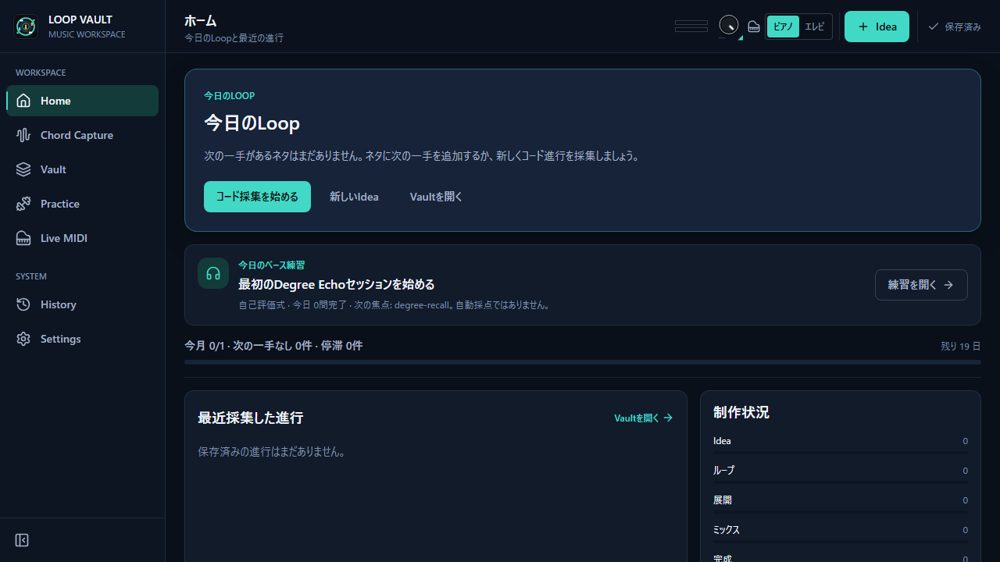
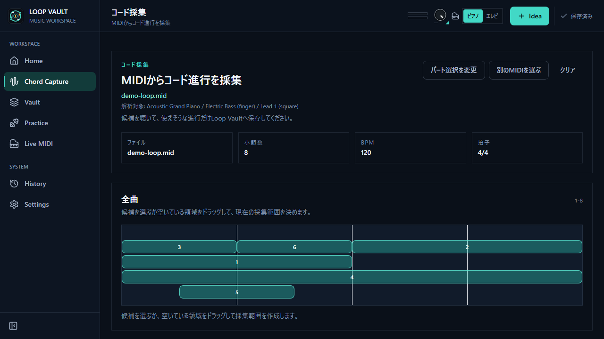
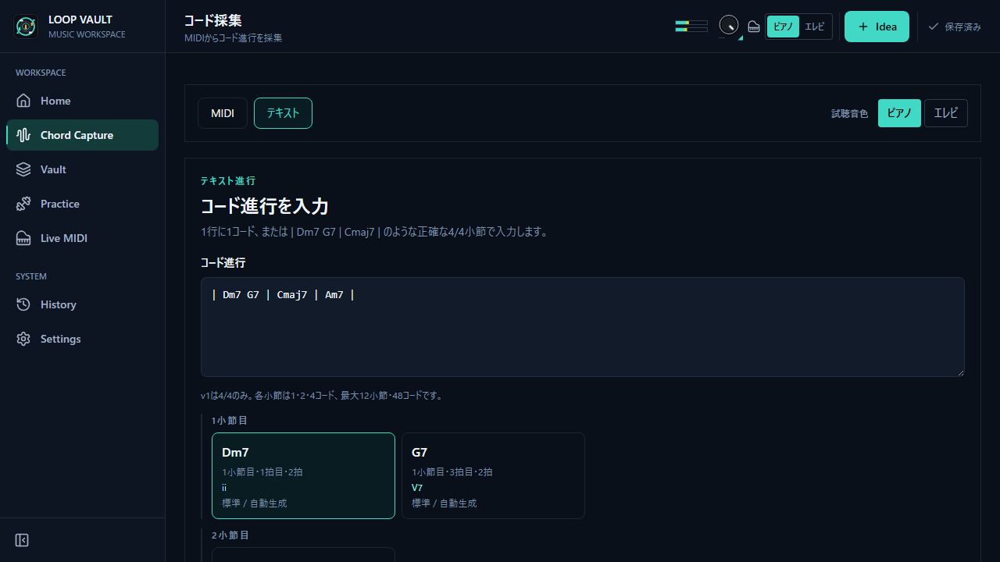
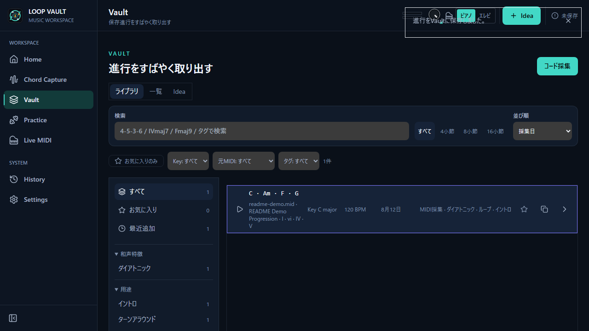
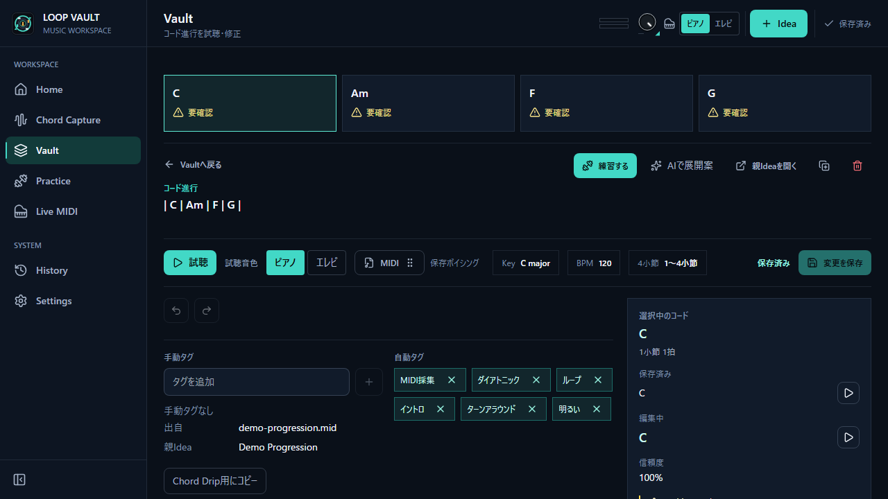
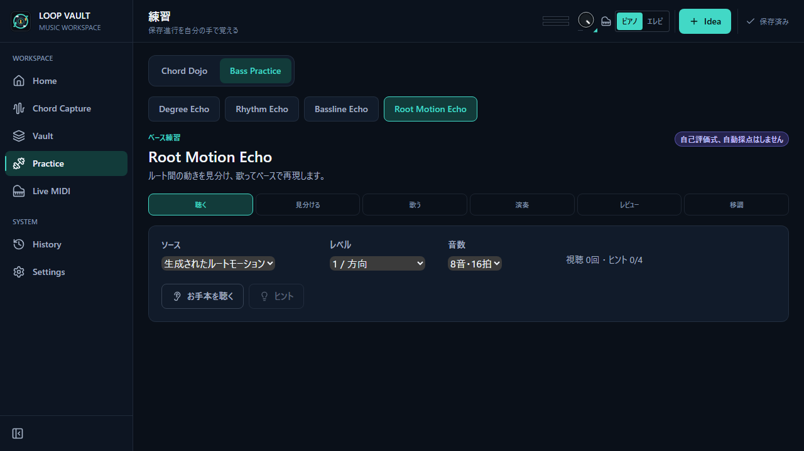

# Loop Vault

**A Windows desktop app for collecting, refining, hearing, practicing, and producing with chord progressions**

[日本語](README.md) | [English](README.en.md)



## Download

**Release target: v2.0.0 (preparing for publication)**

Loop Vault supports Windows. Releases include both an **NSIS** setup executable and an **MSI**
Windows Installer package.

[Download the published release](https://github.com/Takuyakou/loop-vault/releases/latest) · [v2.0.0 Release Notes](docs/release/v2.0.0/release-notes.md)

Distribution includes a direct `loop-vault.exe` as well as installers. Windows WebView2 Runtime is required. v2.0.0 will be published after verification.

## What is Loop Vault?

Loop Vault connects finding a chord progression with everything that comes next: editing, auditioning,
practice, and production.

- **Analyze MIDI** — Load one or more MIDI files and extract chord-progression candidates from the music.
- **Write chord names** — Create a bar-structured progression directly, even when you do not have a MIDI file.
- **Save and use it** — Edit and audition progressions in the Vault, practice them, export MIDI, or drag them into a DAW.

Analysis and editing never modify the source MIDI. Vault data, settings, and practice history are stored
locally and are not uploaded automatically. The former AI Advisor UI is no longer provided. Settings can remove an API key previously saved for that feature.

## Features

### MIDI Capture & Analysis

- Load one or multiple MIDI files and analyze beats, bars, chord candidates, and sections
- Pre-analyze Voices as bass, harmony, pad, melody, percussion, mixed, and related roles; review or correct
  High / Medium / Low confidence results
- Standard, automatic, and custom analysis presets, plus the opt-in **Harmonic Core** mode
- Reduce the chord-detection contribution of melody-like notes when harmony and melody share one Voice
- Inspect cards, piano rolls and timelines; split/merge intervals and refine chords or notes in the Correction Workspace

#### Harmonic Core

Harmonic Core is an **optional mode for prioritizing accompaniment harmony in MIDI that also contains a
melody**. It reduces how strongly melody-like notes contribute to chord detection. It does not delete notes
from the source, rewrite the MIDI file, or replace the default analysis path; enable it only when it fits the material.

### Text Progression Entry

Create and save a progression from the Text tab in Capture without supplying a MIDI file.

```text
| Dm7 G7 | Cmaj7 | Am7 |
```

- Standard / Extended text intake parses bar separators and chord names with clear diagnostics
- Set a key and BPM, choose an automatically generated voicing style, and audition each chord
- Play a voicing on a MIDI keyboard and explicitly mark those notes for the selected chord
- Continue through the shared MIDI / Text Capture and Correction Workspace to preview and Vault save

### Progression Detail & Vault

- Edit and organize chord progressions, key, BPM, sections, titles, and workflow status
- Use per-chord **Voicing Memory** from source MIDI, generated voicings, or notes captured from a keyboard
- Audition a complete progression or individual chords with adjustable sound and tempo
- Export MIDI and use native drag-and-drop into a supported DAW
- Search and organize the Vault by title, key, chord, tag, status, and other metadata

### Chord Dojo

Practice saved progressions step by step with a MIDI keyboard.

- Five levels: See and Play, Play by Name, Play by Degree, Nearby Keys, and Any Key
- Step mode for one chord at a time and Flow mode for playing through the progression
- Voicing practice with the resolved voicing, Auto, Shell, Open, and Rootless choices
- Mix practice with 2–5 progressions plus adjustable BPM, leniency, and cycle count
- Store practice level and progress with the Vault entry

### Bass Practice

A practice workspace built around listening, singing, thinking, playing, and reviewing.

- **Degree Echo** — Hear a short phrase, sing it, understand it by degree, and reproduce it on bass
- **Rhythm Echo** — Hear and remember a rhythm, sing it, then play it
- **Bassline Echo** — Hear and reproduce a bassline over a progression from built-in presets or the Vault
- **Root Motion Echo** — Hear 2–8 chord-root movements, reproduce them on the fretboard, and transpose them
- Chord Context plus 4- or 5-string, right- or left-handed, and fret-range settings
- **Record & Compare** your performance against the reference or an earlier take
- Review results in Practice History

### Voicing Loop

- Current / next chord, timeline, 88-key keyboard and transport in one practice workspace
- Distinct saved, source MIDI, custom and generated voicings; unavailable sources are disabled and partial availability is counted
- Basic / Core generated choices and detailed shape, left-hand, Color and Open settings
- Session-only, chord-snapped A–B Range Loop through right-click or keyboard controls
- Recommended fingerings, fixed personal Saved fingerings and Next Move; ranking does not change pitches or hand assignment

### Limitations

MIDI analysis can require manual correction. Unpromoted Core v2 research does not replace the current Product analyzer.
Recommended fingerings use a relative proxy, not a guarantee of ergonomic suitability or hand-size fit.
Text intake does not invent source MIDI notes. Practice supports its constant-meter scope; changing tempo/meter or unsupported data remains limited. Vault stays on fileVersion 2 and valid practice-incompatible records are preserved.

### Data and localization

- Vault and practice-data persistence, backup, and recovery
- Japanese and English UI
- A workflow that keeps evaluation MIDI, recordings, and personal data out of the repository

## Screenshots

The screenshots below show the earlier v1.1.0 production UI with anonymous deterministic data. The v2.0.0 Correction Workspace and Voicing Loop have changed.

| MIDI Capture / Harmonic Core | Text Progression Entry |
| --- | --- |
|  |  |

| Vault | Progression Detail |
| --- | --- |
|  |  |



## v2.0.0 highlights

- Shared MIDI / Text Correction Workspace with clearer interval editing, save and audition controls
- Extended Text intake, source-first playback and default 120 BPM for SMFs without a tempo event
- Timeline-integrated Voicing Loop, four sources, A–B looping, saved fingerings and Next Move
- Preserved Vault v2, explicitly saved pitches and original MIDI source timing
- Improved restart/first-chord playback, responsive layout, accessibility and test runner reliability

See [v2.0.0 Release Notes](docs/release/v2.0.0/release-notes.md) for details and limitations. SemVer is 2.0.0; Vault fileVersion remains 2.

## Tech Stack

| Area | Technology |
| --- | --- |
| Desktop foundation | Tauri v2 (Rust backend + WebView frontend) |
| Frontend | React 18 / TypeScript |
| Build | Vite 7 |
| State management | Zustand 5 |
| Schema / validation | Zod 3 |
| Audio / MIDI playback | Tone.js 15 |
| Native features | OS keychain, practice-data persistence, MIDI export, native drag to a DAW |
| Testing / QA | Vitest / Playwright / axe-core / Rust tests |

## Architecture / Accuracy Evaluation

The React frontend and Tauri (Rust) native commands are separated at a clear boundary. Core music-theory,
MIDI-analysis, editing, and practice logic lives in `src/domain/` or a feature domain layer, independently
from the UI, and is verified with unit and integration tests.

```text
src/
├─ domain/           Music theory, MIDI analysis, progression editing, Chord Dojo
├─ features/
│  └─ bass-practice/ Bass Practice application / domain / infra / UI
├─ views/            Capture / Vault / Practice / Detail / History
├─ llm/              Tauri bridge for Progression Advisor
└─ i18n.ts           Japanese / English

src-tauri/
└─ src/              Keychain, storage, MIDI export, native drag
```

See [`docs/current-midi-detection-spec.md`](docs/current-midi-detection-spec.md) for the current MIDI-analysis
contract and [`docs/current-app-technical-handoff.md`](docs/current-app-technical-handoff.md) for the wider
technical handoff.

Accuracy improvements are evaluated with fixed corpora, ablation, failure taxonomy, and determinism checks,
not by impression. New detection ideas are first measured as disconnected shadows and are promoted only when
they clear pre-registered thresholds. Declined changes and their rationale remain documented under `docs/`.

- Local evaluation-data setup: [`docs/local-data.md`](docs/local-data.md)
- Ablation example: [`docs/phase3.6.1-ablation-report.md`](docs/phase3.6.1-ablation-report.md)
- Detector research record: [`docs/stage-f/09-detector-research-report.md`](docs/stage-f/09-detector-research-report.md)

Evaluation corpora are not published for licensing and privacy reasons. Normal unit tests and builds run from
a clean clone without those corpora.

## AI-Assisted Development Flow

Specifications, evaluation contracts, and acceptance criteria are fixed before implementation. AI coding tools
then work in separate roles through staged implementation, independent review, verification, and documentation.
Reports and decision records under `docs/` preserve why an implementation or default was chosen.

- [`docs/loop-vault-codex-plan.md`](docs/loop-vault-codex-plan.md)
- [`docs/loop-vault-codex-prompts.md`](docs/loop-vault-codex-prompts.md)
- [`docs/current-app-technical-handoff.md`](docs/current-app-technical-handoff.md)

## Setup for developers

### Prerequisites

- [Node.js](https://nodejs.org/) (LTS recommended)
- [Rust toolchain](https://www.rust-lang.org/tools/install)
- [Tauri v2 prerequisites](https://tauri.app/start/prerequisites/), including WebView2 and the C++ Build Tools on Windows

### Install and develop

```bash
npm ci
npm run dev
```

Run the Tauri desktop app:

```bash
npm run tauri dev
```

### Verify and build

```bash
npm run lint
npm test
npm run test:e2e
npm run build
npm run tauri build
```

## License

**This repository is not open source.** Its source code is published for viewing and evaluation only.
See [LICENSE](LICENSE) for the complete terms.

- Commercial use, modification, and redistribution are prohibited without prior written permission from the copyright holder (All Rights Reserved).
- The bundled FreePats [electric-bass-YR](https://github.com/freepats/electric-bass-YR) samples are CC0-1.0 and include their license.
- MIDI evaluation corpora and personal data are not included in the repository.
