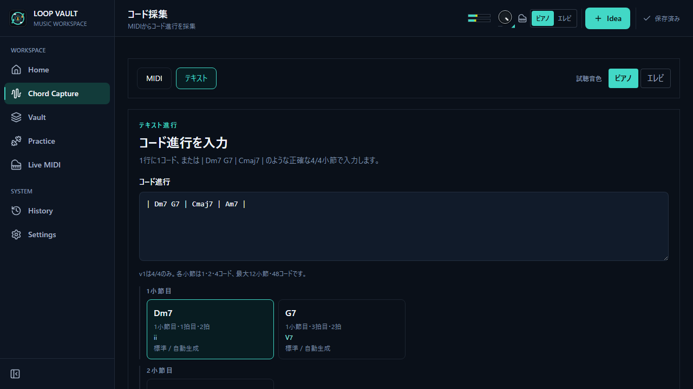

# Loop Vault

**コード進行を集め、整え、鳴らし、練習と制作へつなぐ Windows デスクトップアプリ**

[日本語](README.md) | [English](README.en.md)


## Download

**Latest Release: v1.1.0**

Loop Vault は Windows に対応しています。インストーラーは、一般的なセットアップ形式の
**NSIS** と、Windows Installer 形式の **MSI** を用意しています。

[GitHub Releases から最新版をダウンロード](https://github.com/Takuyakou/loop-vault/releases/latest)

## Loop Vault とは

Loop Vault は、コード進行を「見つける」だけでなく、その後の編集・試聴・練習・制作までを
ひとつにつなぐアプリです。

- **MIDI から解析する** — 1つまたは複数の MIDI ファイルを読み込み、曲の中からコード進行候補を抽出します。
- **コードネームから作る** — MIDI がなくても、コードネームを直接入力して小節単位の進行を作れます。
- **保存して活用する** — Vault に集めた進行を編集・試聴し、練習や MIDI 書き出し、DAW へのドラッグ＆ドロップにつなげます。

解析や編集は元の MIDI ファイルを変更しません。Vault、設定、練習履歴などのデータは
ローカルに保存され、外部へ自動送信されません。Progression Advisor を使う場合だけ、
ユーザー自身の OpenAI API キーで明示的に問い合わせます。

## 主な機能

### MIDI Capture & Analysis

- 1つまたは複数の MIDI ファイルをまとめて読み込み、拍・小節・コード候補を解析
- 解析前に各 Voice を bass / harmony / pad / melody / percussion / mixed などへ分類し、
  信頼度を「高・中・低」と要確認表示で確認・修正
- 標準、自動、カスタムなどの解析プリセットと、伴奏の和声を優先する **和声コア**
- 同じ Voice に和音とメロディが混在する場合、melody-like な音のコード検出への寄与を抑える処理
- 解析結果を Compact Cards、ピアノロール、タイムライン、候補ブロックとして確認し、Draft で修正

#### 和声コア

和声コアは、メロディを含む MIDI で**伴奏の和声を優先して解析するための、任意で選ぶモード**です。
メロディらしい音のコード検出への寄与を弱めますが、元 MIDI から音を削除したり、ファイルを
書き換えたりはしません。既定の標準解析を置き換えるものでもなく、必要な素材で選択して使えます。

### Text Progression Entry

MIDI ファイルがなくても、Capture の「テキスト」からコード進行を登録できます。

```text
| Dm7 G7 | Cmaj7 | Am7 |
```

- 小節区切りとコードネームを解析し、Compact Code Cards と明確な診断を表示
- Key と BPM を設定し、自動生成ボイシングのスタイルを選んで試聴
- MIDI 鍵盤から弾いたボイシングを、選択中のコードへ明示的に保存予定として記録
- 変換後は既存の Capture Draft、Quick Editor、Preview、Vault 保存へそのまま接続

### Progression Detail & Vault

- コード進行、Key、BPM、セクション、タイトル、ステータスを編集・管理
- コードごとの **Voicing Memory** で元 MIDI、自動生成、鍵盤で記録したボイシングを活用
- 進行全体またはコード単位で試聴し、音色やテンポを調整
- MIDI ファイルとして書き出し、対応 DAW へネイティブドラッグ＆ドロップ
- タイトル、Key、コード、タグ、ステータスなどで Vault を検索・整理

### Chord Dojo

保存したコード進行を MIDI 鍵盤で段階的に練習できます。

- L1「見て弾く」から、コードネーム、度数、近いキー、任意キーへ進む5段階
- 1コードずつ確認する Step と、進行を止めずに弾く Flow
- 元のボイシング、自動、Shell、Open、Rootless などを使ったボイシング練習
- 2〜5個の進行を組み合わせる Mix 練習、BPM・判定の厳しさ・周回数の調整
- 練習段位と進捗を Vault に保存

### Bass Practice

ベースで「聴く・歌う・考える・弾く・振り返る」を繰り返すための練習ワークスペースです。

- **Degree Echo** — 短いフレーズを聴き、歌い、度数で捉えてからベースで再現
- **Rhythm Echo** — リズムを聴いて思い出し、歌ってから演奏
- **Bassline Echo** — コード進行とベースラインを聴き、再現。内蔵プリセットまたは Vault の進行を利用
- **Root Motion Echo** — コードのルート移動を2〜8音で聴き取り、指板上で再現・移調
- Chord Context、4弦 / 5弦、右利き / 左利き表示、フレット範囲などの演奏条件
- **Record & Compare** で自分の演奏を録音し、お手本や過去テイクと聴き比べ
- Practice History で練習結果と履歴を振り返り

### Progression Advisor

Vault の進行をもとに、次の展開や置き換え候補を AI に相談できます。OpenAI API キーは
OS のキーチェーンで管理し、保存前に提案内容を確認できます。

### データ管理と言語

- Vault と練習データの保存、バックアップ、復旧
- 日本語 / 英語 UI
- 評価用 MIDI、録音、個人データをリポジトリへ含めない運用

## Screenshots

すべて匿名の固定データを使った v1.1.0 の production UI です。

| MIDI Capture / 和声コア | Text Progression Entry |
| --- | --- |
|  |  |

| Vault | Progression Detail |
| --- | --- |
|  |  |


## v1.1.0 highlights

- Text Progression Entry により、MIDI がなくてもコードネームから進行を作成
- Bass Practice に Root Motion Echo、Chord Context、Record & Compare、Vault 連携を追加
- Chord Dojo の段階練習、移調、ボイシング、Mix 練習を拡張
- MIDI Voice role 推定、和声コア、同一 Voice 内の melody-like note weighting で解析フローを改善
- Voicing Memory、MIDI 書き出し、DAW ドラッグ、履歴・UI・アクセシビリティを改善

v1.1.0 に既知の破壊的変更はなく、既存の Vault / 練習データは追加 migration なしで互換性を
維持します。詳細は [v1.1.0 Release Notes](docs/releases/v1.1.0.md) を参照してください。

## 技術スタック

| 領域 | 採用技術 |
| --- | --- |
| デスクトップ基盤 | Tauri v2（Rust バックエンド + WebView フロント） |
| フロントエンド | React 18 / TypeScript |
| ビルド | Vite 7 |
| 状態管理 | Zustand 5 |
| スキーマ / バリデーション | Zod 3 |
| 音声 / MIDI 再生 | Tone.js 15 |
| ネイティブ機能 | OS キーチェーン、練習データ永続化、MIDI 書き出し、DAW へのネイティブドラッグ |
| テスト / QA | Vitest / Playwright / axe-core / Rust tests |

## Architecture / Accuracy Evaluation

React フロントエンドと Tauri（Rust）のネイティブコマンドを境界で分離しています。
音楽理論・MIDI 解析・練習などの中核ロジックは UI から独立した純粋関数として
`src/domain/` と各 feature の domain 層に置き、単体テストと統合テストで検証しています。

```text
src/
├─ domain/           音楽理論・MIDI解析・進行編集・Chord Dojo
├─ features/
│  └─ bass-practice/ Bass Practice の application / domain / infra / ui
├─ views/            Capture / Vault / Practice / Detail / History
├─ llm/              Progression Advisor の Tauri bridge
└─ i18n.ts           日本語 / 英語

src-tauri/
└─ src/              キーチェーン、データ保存、MIDI export、native drag
```

現在の MIDI 解析仕様は
[`docs/current-midi-detection-spec.md`](docs/current-midi-detection-spec.md)、アプリ全体の技術メモは
[`docs/current-app-technical-handoff.md`](docs/current-app-technical-handoff.md) にあります。

精度改善は感覚ではなく、固定コーパス、アブレーション、失敗分類、決定性確認で評価します。
新しい検出アイデアはまず product に接続しない shadow として測り、事前に固定した閾値を通過した
ものだけを昇格します。採用しなかった結果も判断理由とともに `docs/` へ残します。

- 評価データのローカル配置: [`docs/local-data.md`](docs/local-data.md)
- アブレーション例: [`docs/phase3.6.1-ablation-report.md`](docs/phase3.6.1-ablation-report.md)
- 検出研究の記録: [`docs/stage-f/09-detector-research-report.md`](docs/stage-f/09-detector-research-report.md)

評価用コーパスはライセンスとプライバシーの理由から公開していません。通常の単体テストや build は
クリーンな clone だけで実行できます。

## AI を用いた開発フロー

仕様・評価契約・受け入れ条件を実装前に固定し、AI コーディングツールを役割分担させながら
ステージ単位で実装、独立レビュー、検証、記録を行っています。作業報告と判断記録を `docs/` に
残し、「なぜこの実装・既定値になったか」を後から追跡できるようにしています。

- [`docs/loop-vault-codex-plan.md`](docs/loop-vault-codex-plan.md)
- [`docs/loop-vault-codex-prompts.md`](docs/loop-vault-codex-prompts.md)
- [`docs/current-app-technical-handoff.md`](docs/current-app-technical-handoff.md)

## Setup for developers

### 前提

- [Node.js](https://nodejs.org/)（LTS 推奨）
- [Rust toolchain](https://www.rust-lang.org/tools/install)
- [Tauri v2 の前提条件](https://tauri.app/start/prerequisites/)（Windows の WebView2 / C++ Build Tools 等）

### インストールと開発

```bash
npm ci
npm run dev
```

Tauri アプリとして起動:

```bash
npm run tauri dev
```

### 検証と build

```bash
npm run lint
npm test
npm run test:e2e
npm run build
npm run tauri build
```

## ライセンス

**本リポジトリはオープンソースではありません。** ソースコードは閲覧・評価のみを目的として
公開しています。詳細は [LICENSE](LICENSE) を参照してください。

- 著作権者の書面による許可なく、商用利用・改変・再配布は禁止です（All Rights Reserved）。
- ベース音色の FreePats
  ([electric-bass-YR](https://github.com/freepats/electric-bass-YR)) は CC0-1.0 で、ライセンスとともに同梱しています。
- MIDI 評価コーパスや個人データはリポジトリに含まれていません。
