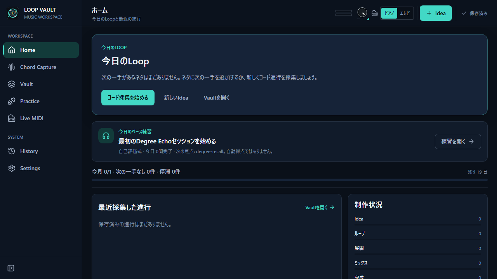
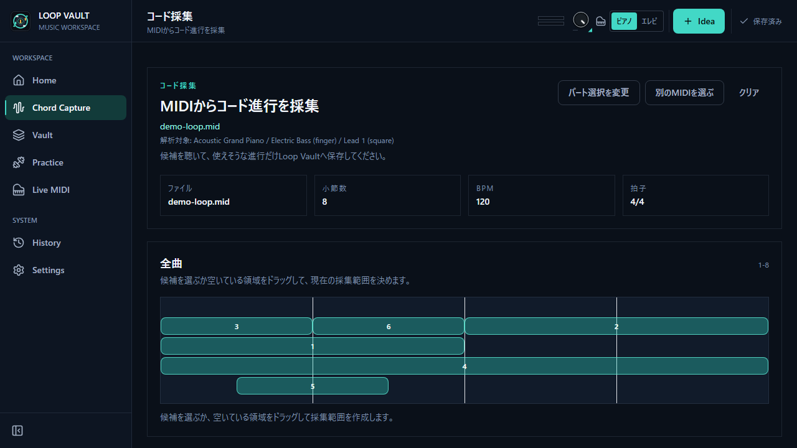
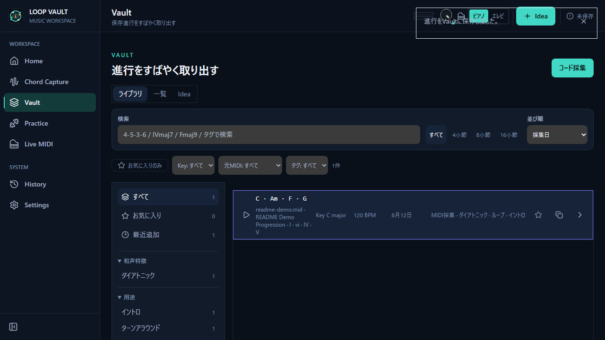
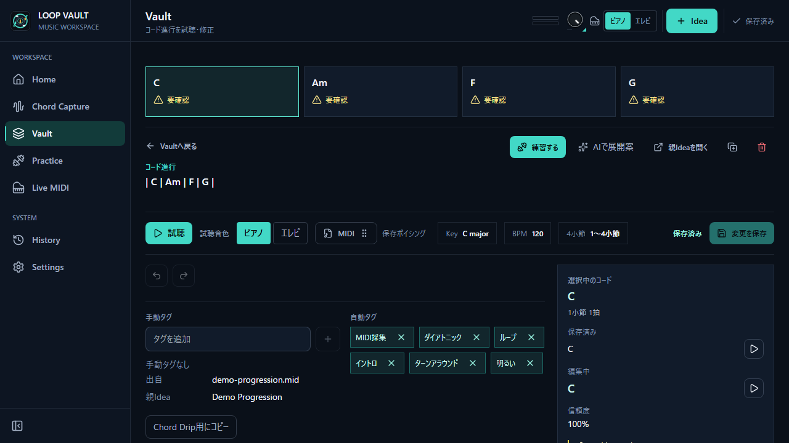
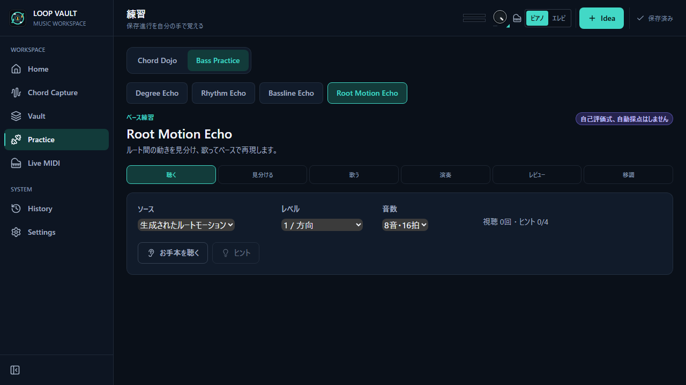

<div align="center">

# Loop Vault

**MIDI からコード進行を解析し、編集・試聴・練習までを 1 つのデスクトップアプリで扱うための音楽制作支援ツール**

Tauri v2 + React + TypeScript + Rust で構築したデスクトップアプリケーションです（主に Windows で開発・動作確認しています）。

**日本語** | [English](README.en.md)



</div>

> **公開リポジトリについて**
> このリポジトリには MIDI ファイルを含めていません（ライセンス上の理由）。
> ソースの閲覧・ビルド・単体テストの実行に MIDI データは不要です。
> 精度評価を手元で再現する場合の配置は [`docs/local-data.md`](docs/local-data.md) を参照してください。

---

## 目次

- [概要](#概要)
- [主な機能](#主な機能)
- [スクリーンショット](#スクリーンショット)
- [技術スタック](#技術スタック)
- [アーキテクチャ](#アーキテクチャ)
- [コード進行検出の精度改善への取り組み方](#コード進行検出の精度改善への取り組み方)
- [AI を用いた開発フロー](#ai-を用いた開発フロー)
- [セットアップ](#セットアップ)
- [今後の方向性](#今後の方向性)
- [ライセンス](#ライセンス)

---

## 概要

Loop Vault は、DTM / 作曲時の「MIDI からコード進行を把握し、素材として整理・練習する」
という一連の流れを支援するデスクトップアプリです。

- MIDI ファイルを取り込むと、コード進行を自動で解析してタイムラインとして表示します。
- 解析結果はそのまま鵜呑みにするのではなく、**解析前の下ごしらえ**（どのボイスを解析対象に
  するか等）や、**解析後の手直し**（範囲選択・コード修正・試聴）ができます。
- 気に入ったループやアイデアは「Vault」に保存し、制作の進捗ステータスとともに管理できます。
- コード進行の練習（度数・リズム・ベースなど）を行うモードや、LLM に展開のアイデアを
  相談する機能も備えています。

アプリの本体（既定の解析モード）は、後述の評価プロセスを経て固定した安定版を使用しています。

## 主な機能

以下は、いずれもリポジトリ内に実装が存在する機能です。

### MIDI 取り込みとコード進行解析（Capture）
- MIDI ファイル（複数ファイルの取り込みにも対応）から、コード進行を自動解析します。
- 解析前に、対象とするボイス（パート）の役割を指定し、Canvas 上のピアノロールで
  解析対象を調整してから解析を実行できます。
- 解析結果は、4 / 8 / 16 小節などの**候補ブロック**として提示されます。

### 候補の手動作成・編集（Candidate Catalog / 手動候補）
- 自動検出された候補の一覧（カタログ）から選ぶだけでなく、タイムライン上で**任意の範囲を
  選択して候補を作成**できます。
- 候補の範囲やコードイベント（追加・削除・置換・分割・結合・移動）を編集でき、
  Undo / Redo に対応しています。

### コード進行の詳細・試聴・書き出し（Progression Detail）
- コード進行をタイムラインで確認し、各コードを編集できます。
- 元 MIDI のボイシングを保持する **Voicing Memory** を持ち、試聴や練習に反映します。
- [Tone.js](https://tonejs.github.io/) による試聴に対応しています。
- 解析・編集した進行を MIDI として書き出し、DAW へ**ネイティブにドラッグ&ドロップ**で
  渡すことができます（Rust 側の `midi_export` / `native_drag` コマンドで実装）。

### アイデア / ループの管理（Vault）
- 取り込んだループやアイデアを保存し、制作ステータス（Idea / Loop / Arrange / Mix / Done）
  とともに一覧・管理できます。
- 次にやること（Next Action）やフォーカスなど、制作を前に進めるための整理を支援します。

### 練習モード（Practice / Bass Practice）
- コード進行を題材にした練習モードを備えます（移調・ミックスなどに対応）。
- **Bass Practice**（P5.16 で追加）では、度数（Degree）・リズム・ベースライン模奏
  （Bassline Echo）といった、ベース練習用の独立したエクササイズを提供します。
  ベース音色には FreePats のサウンドを使用しています。

### コード進行アドバイザー（Progression Advisor / LLM）
- OpenAI の API を用いて、コード進行の展開アイデアを相談できる機能です。
- **API キーはフロントエンド側に保存しません。** アプリ内の設定から入力したキーを、
  Tauri(Rust) 経由で **OS のキーチェーン**（Windows 資格情報マネージャー等）に保存します
  （実装: [`src-tauri/src/llm/keychain.rs`](src-tauri/src/llm/keychain.rs)）。

### データの保存・バックアップ・復旧
- 練習データ等の保存・読み込みに加え、バックアップの一覧・復元・退避（quarantine）を
  Rust 側（`practice_storage`）で扱います。

### 多言語
- 日本語 / 英語の切り替えに対応しています（`src/i18n.ts`）。

## スクリーンショット

以下はいずれも**合成したダミー MIDI / ダミーデータ**で撮影しています（撮影方法:
[`docs/images/README.md`](docs/images/README.md)）。

| Capture（MIDI 解析） | Vault（管理） |
| --- | --- |
|  |  |

| Progression Detail（詳細・試聴・書き出し） | Bass Practice（Degree Echo） |
| --- | --- |
|  |  |

## 技術スタック

| 領域 | 採用技術 |
| --- | --- |
| デスクトップ基盤 | Tauri v2（Rust バックエンド + WebView フロント） |
| フロントエンド | React 18 / TypeScript |
| ビルド | Vite 7 |
| 状態管理 | Zustand 5 |
| スキーマ / バリデーション | Zod 3 |
| 音声 / MIDI 再生 | Tone.js 15 |
| ネイティブ機能（Rust） | OS キーチェーン連携（LLM キー）、練習データ永続化、MIDI 書き出し、DAW へのネイティブドラッグ |
| テスト | Vitest |
| Lint | ESLint |

## アーキテクチャ

フロントエンド（React）と、Tauri(Rust) のネイティブコマンドを境界で分離した構成です。
音楽理論・MIDI 解析などの中核ロジックは、UI から独立した純粋関数として `src/domain/`
に置き、単体テストで検証しています。

```
src/
├─ domain/           音楽理論・MIDI 解析・コード進行ロジック（UI 非依存、テスト対象）
│  ├─ midi/          MIDI 解析パイプライン、候補ブロック生成、手動候補（Draft）など
│  ├─ harmony/       ハーモニー関連
│  ├─ practice*/     練習・移調・ミックス
│  └─ progressionAdvisor/  LLM アドバイザー用のドメインロジック
├─ views/            画面（Capture / Vault / Home / Practice / ProgressionDetail / History / Detail）
├─ features/
│  └─ bass-practice/ ベース練習機能（application / domain / infra / ui / assets）
├─ llm/              LLM 呼び出しのブリッジ（Tauri invoke 経由）
└─ i18n.ts           日本語 / 英語

src-tauri/           Tauri(Rust) 側
└─ src/
   ├─ llm/keychain.rs      OpenAI API キーを OS キーチェーンで管理
   ├─ practice_storage     練習データの保存・バックアップ・復旧
   └─ midi_export / native_drag  MIDI 書き出しと DAW へのネイティブドラッグ
```

中核となる MIDI 解析仕様の詳細は
[`docs/current-midi-detection-spec.md`](docs/current-midi-detection-spec.md)、
アプリ全体の技術的な引き継ぎメモは
[`docs/current-app-technical-handoff.md`](docs/current-app-technical-handoff.md)
にまとめています。

## コード進行検出の精度改善への取り組み方

コード進行の検出精度は「なんとなく良くなった気がする」で判断しないことを方針にしています。
本リポジトリでは、検出ロジックの変更を以下のプロセスで評価・記録しています。

- **Gold コーパスによるベースライン固定**
  正解ラベルを人手で確認した MIDI 群（Gold コーパス）を評価の基準として固定し、
  変更前後を同じ指標で比較します。コーパス自体はライセンス上の理由から公開していません
  （[`docs/local-data.md`](docs/local-data.md)）。

- **アブレーション（ablation）**
  検出の各要素を個別に有効化 / 無効化し、どの要素が精度にどれだけ寄与しているかを
  切り分けて測定します（例: [`docs/phase3.6.1-ablation-report.md`](docs/phase3.6.1-ablation-report.md)、
  スクリプト `scripts/ablate-midi-analysis.ts`）。

- **失敗の分類（failure taxonomy）**
  外した事例を「なぜ外したか」で分類し、対策の優先順位付けに使います
  （スクリプト `scripts/analyze-midi-failures.ts` ほか）。

- **Decision Lock（判断の固定）と shadow 評価**
  新しい検出アイデアは、まず製品には接続しない「shadow（影）」として計算し、Gold コーパスに
  対して事前登録した閾値で評価します。効果が基準に満たない場合は**製品へ昇格させず**、
  その判断と理由を記録として残します。Stage F の一連の研究では、この方針に沿って複数の
  検出器を評価し、**昇格しなかったものも含めて**結果を文書化しています
  （[`docs/stage-f/09-detector-research-report.md`](docs/stage-f/09-detector-research-report.md)、
  [`docs/stage-f/08-stage-f-final-closeout.md`](docs/stage-f/08-stage-f-final-closeout.md)、
  [`docs/stage-f/03-stage-f-decisions.md`](docs/stage-f/03-stage-f-decisions.md)）。

このように、**採用した変更だけでなく、採用を見送った変更も理由とともに残す**ことで、
同じ検証を繰り返さずに済むようにしています。

## AI を用いた開発フロー

本プロジェクトは、AI コーディングツールを役割分担させながら、チケット駆動で開発を
進めています。

- **仕様・設計**: Claude Code を用いて、各フェーズ（チケット）のゴール・評価契約・
  受け入れ条件を先に固め、実装前に検証方法まで決めます。
- **実装**: 固めた仕様に沿って Codex（別の AI）が実装を担当します。
- **チケット駆動**: 作業は「フェーズ番号 + ステージ」（例: P4.1.2-H4、P5.16 など）の単位で
  区切り、各ステージの計画・プロンプト・引き継ぎ内容をドキュメントとして残します
  （[`docs/loop-vault-codex-plan.md`](docs/loop-vault-codex-plan.md)、
  [`docs/loop-vault-codex-prompts.md`](docs/loop-vault-codex-prompts.md)、
  [`docs/current-app-technical-handoff.md`](docs/current-app-technical-handoff.md)）。

`docs/` 配下には、各フェーズの作業レポート・評価結果・意思決定の記録が蓄積されており、
「どういう根拠でこの実装・この既定値になったか」を後から追えるようにしています。

## セットアップ

### 前提

- [Node.js](https://nodejs.org/)（LTS を推奨）
- [Rust ツールチェイン](https://www.rust-lang.org/tools/install)（Tauri のビルドに必要）
- Tauri v2 の実行前提（Windows の場合は WebView2 と Microsoft C++ Build Tools 等）。
  詳細は [Tauri 公式の前提条件](https://tauri.app/start/prerequisites/) を参照してください。

### 依存関係のインストール

```bash
npm install
```

### 開発

ブラウザ上でフロントエンドのみ起動する場合:

```bash
npm run dev
```

デスクトップアプリ（Tauri）として起動する場合:

```bash
npm run tauri dev
```

### ビルド

フロントエンドのビルド:

```bash
npm run build
```

デスクトップアプリの配布ビルド:

```bash
npm run tauri build
```

### テスト / Lint

```bash
npm run test
```

```bash
npm run lint
```

> 単体テストは MIDI 評価コーパスに依存せず、クリーンな clone の状態でも実行できます。
> 精度評価用のスクリプト（`scripts/` 配下）を動かす場合のみ、
> [`docs/local-data.md`](docs/local-data.md) に従って MIDI を配置してください。

## 今後の方向性

開発はフェーズ単位で継続しています。方向性としては、コード進行検出の精度改善（前述の
Gold コーパス・アブレーション・失敗分類に基づく反復）と、練習機能の拡充を中心に進めています。
具体的な変更は、各フェーズの `docs/` 配下のレポートに記録していきます。

## ライセンス

**本リポジトリはオープンソースではありません。** ソースコードは**閲覧・評価のみ**を目的として
公開しています（詳細は [LICENSE](LICENSE)）。

- 著作権者の書面による許可なく、**商用利用・改変（派生物の作成）・再配布は禁止**です。
- 上記を含め、原則としてあらゆる利用を許可していません（All Rights Reserved）。
- GitHub 上での閲覧・fork（GitHub 規約の範囲）は、上記で保留した権利を許諾するものではありません。
- ベース音色に使用している FreePats（[electric-bass-YR](https://github.com/freepats/electric-bass-YR)）の
  サンプルは提供元の CC0-1.0（パブリックドメイン相当）で、`src/features/bass-practice/assets/freepats-bass-yr/`
  にライセンス（`LICENSE.txt`）とともに同梱しています。
- MIDI 評価コーパス等のデータはリポジトリに含まれていません。
