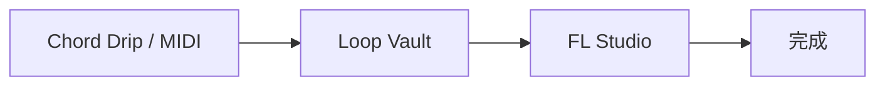

# Loop Vault

Loop Vaultは、作りかけのループやコード進行を「完成まで進める」ためのデスクトップアプリです。

思いついたネタをただ溜めるだけではなく、各アイデアに次の一手を1つだけ持たせ、今日取り組むべきFocusを見つけやすくします。Phase 2では、MIDIからコード進行を解析し、よさそうな進行ブロックを保存して再利用できるようになりました。

## できること

- Idea / Loop / Arrange / Mix / Done の状態で曲ネタを管理
- 各アイデアにNext Actionを1つ設定
- 今日取り組むFocus候補を表示
- 月間完成目標の進捗を表示
- `.flp`、`.mid`、`.wav`などのローカルアセットを登録
- MIDIファイルからコード進行タイムラインを解析
- 4 / 8 / 16小節のコード進行候補を確認
- 候補のコードを編集、単体試聴、進行全体で試聴
- コード進行ブロックを新規Ideaとして保存
- コード進行ブロックを既存Ideaへ追加
- 保存済み進行ブロックをDetail画面で確認、試聴、削除
- Settingsから日本語 / Englishを切り替え
- JSONのimport / export、バックアップ、破損データ退避

## ワークフロー



Loop Vaultは、コード進行やMIDIから生まれたアイデアを、DAWで完成させるまでの作業台として使います。思いつき、コードメモ、MIDI、プロジェクトファイル、次の作業を1つのIdeaにまとめます。

## 開発環境

必要なもの:

- Node.js 20+
- Rust stable toolchain
- Windows

インストール:

```bash
npm install
```

開発起動:

```bash
npm run tauri dev
```

ブラウザだけでUIを確認する場合:

```bash
npm run dev
```

テストとビルド:

```bash
npm test
npm run build
```

デスクトップアプリをビルド:

```bash
npm run tauri build
```

### Playwright UI検証

初回のみChromiumをインストールします。

```bash
npm run playwright:install
```

production build、preview serverの起動・停止、E2E、visual regressionは次の1コマンドで実行できます。

```bash
npm run test:e2e
```

基準画像を意図的に更新する場合だけ、差分を目視確認してから次を実行します。

```bash
npm run test:e2e:update
```

失敗時のスクリーンショット、video、traceは`test-results/`、HTML reportは
`playwright-report/`へ生成されます。確認には次を使用します。

```bash
npm run test:e2e:report
```

Codex内蔵Playwright kernelではなく、リポジトリに固定したPlaywright CLIを検証の正とします。
Web previewではファイルピッカー、OS MIDIデバイス、Tauriウィンドウ操作を完全再現できないため、
それらはTauri buildとデスクトップ実機確認を分けて行います。個人MIDIはE2Eへ追加せず、
テスト内で生成するSMF fixtureを使用します。

ビルド後のexeは通常、次の場所に生成されます。

```text
src-tauri/target/release/loop-vault.exe
```

## データ保存

Loop Vaultのデータは、Tauriの`appDataDir`配下にある`loopvault`フォルダへ保存されます。

- `data.json`: メインのVaultデータ
- `data.json.tmp`: アトミック書き込み用の一時ファイル
- `backups/data-YYYYMMDD-HHmm.json`: 起動時バックアップ
- `data.corrupt-YYYYMMDD-HHmmss.json`: 破損JSONを退避したファイル

`data.json`は平文JSONです。曲名、メモ、ローカルファイルの絶対パスを含む可能性があります。暗号化はしていません。ユーザーが直接確認、復旧しやすいことを優先しています。

## バックアップと復旧

- 起動時にバックアップを作成
- バックアップは新しいものから20世代を保持
- 保存は一時ファイルへ書いてからrenameするアトミック書き込み
- JSONが破損している場合は`data.corrupt-*`へ退避し、無言で上書きしない
- exportは任意の場所へJSONを書き出し
- importは全置換とマージに対応
- fileVersionがアプリの対応範囲より新しい場合は読み取り専用扱い

## MIDI解析とコード試聴

Phase 2では、MIDI Progression Timeline & Captureを追加しました。

- `@tonejs/midi`でMIDIを読み込み
- 解析直後に自前のTimedNote形式へ変換
- 解析ロジックはライブラリ非依存の純関数として実装
- コードは文字列だけではなく`ChordSymbol`として構造化
- 解析結果全体は`data.json`へ保存しない
- ユーザーが保存した`SavedProgressionBlock`だけをIdeaへ永続化
- `tone`を使ってピアノ音色でコードを試聴

## Chord Dripとの関係

Chord Dripのコードカード、進行表示、再生進捗の考え方をLoop Vault側へ移植しています。

現時点では、Chord Dripとの完全な双方向連携ではありません。Loop Vault側では、MIDI解析結果や保存済みコード進行ブロックを見やすく表示し、音で確認できるところまでを実装しています。

## アーキテクチャ

Loop Vaultは主に4つの層に分けています。

- UI層: Reactコンポーネントと画面操作
- 状態管理層: Zustand store、autosave、import/export操作
- ドメイン層: ステータス遷移、Focus選定、月間集計、MIDI解析などの純粋ロジック
- 永続化層: JSON読み書き、バックアップ、破損データ退避

`src/domain/*`はReact、Zustand、Tauri APIに依存させない方針です。新しい解析ロジックやデータ変換は、まずdomain層に純関数として置くのが基本です。

## 検証コマンド

よく使う確認コマンド:

```bash
npm run lint
npm test
npm run build
npm run tauri build
```

## 今後の候補

- MIDI解析結果の視覚化をさらに細かくする
- オーディオからのコード検出
- Chord Dripとのより深い連携
- 移動したアセットの再リンク支援
- Ideaごとの履歴/滞留時間の可視化
- 将来的なSQLite移行
