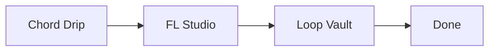

# Loop Vault

Loop Vault is a desktop app for turning unfinished music ideas into finished tracks. Instead of acting like a giant note dump, it keeps one clear Next Action, surfaces the best focus item for today, and makes it easier to move a loop all the way to Done.

> Screenshot note: the current MVP UI lives in the Tauri shell and the local browser preview. Add a native screenshot here after the first release capture.

## Workflow



Loop Vault sits between idea generation and final delivery. Chords, MIDI, rough renders, and project files can all point back into one record, so the app becomes the place where progress decisions happen.

## Features

- Focus view with status-aware prioritization and stale-item warnings
- One-slot Next Action workflow for every active idea
- Pipeline tracking across `idea`, `loop`, `arrange`, `mix`, and `done`
- Monthly completion progress with a configurable goal
- Asset launch and folder reveal for approved local file types
- Startup recovery, backup restore, import, and export flows

## Setup

Requirements:

- Node.js 20+
- Rust stable toolchain
- Windows is the current target for local desktop runs

Install and run:

```bash
npm install
npm run tauri dev
```

Test and build:

```bash
npm test
npm run build
```

For a production desktop bundle:

```bash
npm run tauri build
```

## Data Storage

Loop Vault stores its app data under the Tauri `appDataDir`, inside a `loopvault` folder with these files:

- `data.json`: the main vault file
- `data.json.tmp`: the temporary atomic-write file
- `backups/data-YYYYMMDD-HHmm.json`: startup backups
- `data.corrupt-YYYYMMDD-HHmmss.json`: quarantined corrupt files

Important: `data.json` is plain text JSON. It can contain song titles, notes, and absolute local file paths. The app does not encrypt this file because easy user inspection and recovery are part of the product goal.

## Backup And Recovery

- Every startup creates one backup snapshot and keeps the newest 20 generations.
- Export writes a timestamped JSON copy wherever you choose.
- Import supports `replace` and `merge`.
- Merge keeps the newer record when two ideas share the same `id`.
- If `data.json` is broken JSON, the app moves it aside as `data.corrupt-*.json` and opens recovery mode instead of silently overwriting it.
- If the vault `fileVersion` is newer than the app supports, Loop Vault opens in read-only mode and asks you to update the app.

## Chord Drip Integration

The MVP integration is intentionally simple:

- paste progression text into `chordMemo`
- attach generated `.mid` files as assets

The next step is a dedicated `chordDrip` payload field that can store imported generation results directly, using the same validation-first import approach as the rest of the vault.

## Architecture

Loop Vault is split into three layers:

- Repository layer for load/save/export/import/backup behavior
- Domain layer for pure logic like transitions, focus scoring, monthly stats, and filtering
- Zustand store plus React UI for app state and interaction flow

The repository is already isolated behind an interface so the current JSON file storage can later move to SQLite without rewriting the domain logic or the UI flow.

## Roadmap

- Native screenshot and release polish
- Stronger asset relinking tools for moved project folders
- Richer Chord Drip import beyond text and MIDI attachment
- Optional timeline/history insights for how long ideas stay in each stage
- Future storage migration path from JSON to SQLite if the vault grows large
