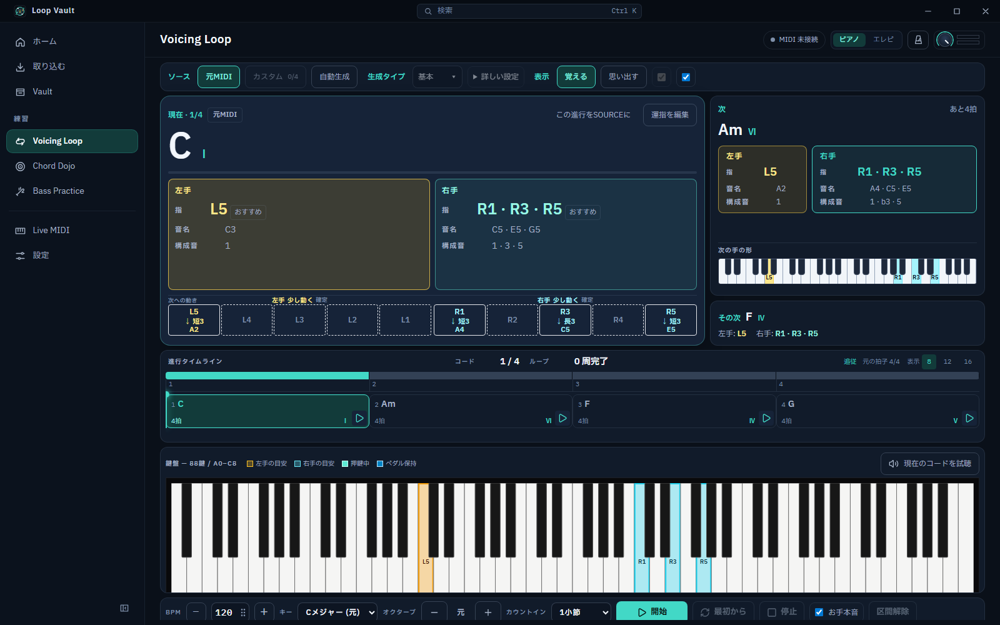
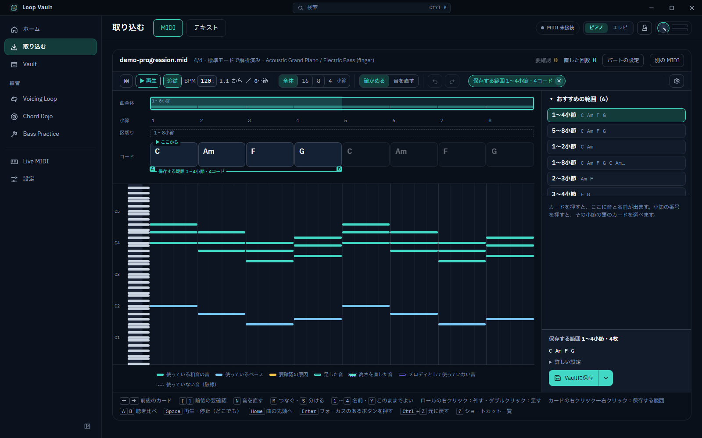
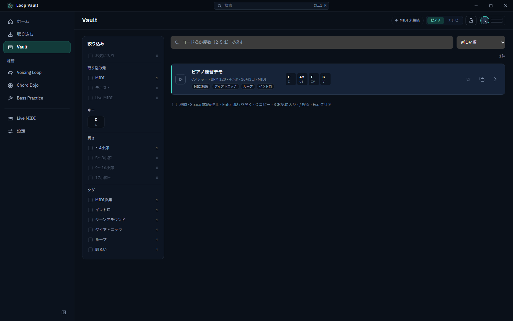

# Loop Vault

MIDIやコード進行を取り込み、コードとボイシングを修正・保存し、そのまま鍵盤練習へつなげるWindowsアプリです。
ボイシングとは、コードを実際にどの音・高さ・並びで鳴らすか、ということです。

- MIDIからコード進行と、その区間で鳴っている音を取り込む
- 修正作業場で、解析結果の音・コード名・区切りを直す
- 気に入った進行をVaultへ保存し、検索・整理する
- 保存した音・元MIDI・カスタム・自動生成を切り替えて試聴する
- Voicing Loopで鍵盤・運指・次への動きを見ながら反復練習する

**Windows版 v2.0.0： [ダウンロード・日本語リリースノート](https://github.com/Takuyakou/loop-vault/releases/tag/v2.0.0)**

[日本語](README.md) | [English](README.en.md)



*画像はv2.0.0の画面です。自作の合成MIDIを使っており、個人のVaultやMIDIは含みません。*

## Loop Vaultとは

「残したい音を選ぶ」「進行として保存する」「繰り返し弾く」までをつなぐアプリです。
曲の一部分を練習用に集めたいときや、自分のボイシングを保存して弾き方を確認したいときに使えます。
MIDIがなくても、コード名をテキスト入力して進行を作れます。

## 基本ワークフロー

```text
MIDI / テキストのコード進行を取り込む
        ↓
MIDIを解析 / テキストの記法を確認して試聴
        ↓
必要なら音・コード名・区切りを修正
        ↓
保存する範囲を選び、Vaultへ保存
        ↓
保存した進行を開く
        ↓
Voicing Loopで試聴・反復練習
```

はじめて使う場合は、サイドバーの「取り込む」からMIDIを読み込み、解析後に「Vaultに保存」を選んでください。
Voicing LoopではVaultの進行を選び、音の出どころを確認して「開始」を押します。

## MIDI Import & Correction Workspace

### MIDIを取り込む

「取り込む」のMIDI画面でファイルを選ぶか、ドラッグ＆ドロップします。複数ファイルの取り込みにも対応しています。
解析前に、どのパートを対象にするか、ベース・和音・メロディなどの役割を確認・変更できます。
解析すると、コードカードとピアノロール、おすすめの保存範囲が表示されます。

コード名だけでなく、元MIDIから抽出した音の高さや配置も保存・再生に利用します。
スラッシュコードのベース音も扱いますが、音が密集した曲や複雑な和声では確認・修正が必要になる場合があります。

### 解析結果を修正する

修正作業場（Correction Workspace）では、音を聴きながら、残したい進行に整えられます。

- **音を直す**：不要な音を除外し、除外した音を戻す。音の追加や高さの変更も可能
- **コードを直す**：コード名や候補を確認・変更する
- **区切りを直す**：コードの分割・結合や境界の調整を行う
- **聴き比べる**：元の音と修正後の音を比較し、変更を元に戻す・やり直す
- **保存する**：範囲を指定し、その範囲のコード進行とボイシングをVaultへ保存する

編集はアプリ内の解析結果に対して行い、読み込んだ元MIDIファイルを書き換えません。



## Vault

Vaultは、取り込んだ進行や手入力した進行を集めておく場所です。

- コード進行、各コードの音、区間のタイミングを保存
- タイトル、キー、BPM、タグ、メモ、取り込み元の情報を管理
- コード名・度数による検索や、キー・長さ・取り込み元・タグで絞り込み
- お気に入り、試聴、複製、進行の詳細表示

進行の詳細画面では、コードやボイシングを編集し、Voicing Loopへ進めます。
対応する進行はMIDIとして書き出し、DAWへドラッグ＆ドロップして制作に使えます。



## Voicing Loop

保存した進行を、コードごとの音と弾き方を見ながら繰り返し練習する画面です。
現在のコードを大きく表示し、次のコード・その次のコード、進行タイムライン、88鍵の鍵盤を同時に確認できます。

### 音の出どころ（Voicing Source）

| 選択肢 | どの音を鳴らすか |
| --- | --- |
| 保存した音 | Vaultでそのコードの再生用に選ばれている保存済みの音。修正した音や、保存時に確定したテキストの試聴音も含みます |
| 元MIDI | 取り込んだMIDIからコードごとに保存された音。修正作業場で除外した音は保存対象から外れます |
| カスタム | 鍵盤で登録した音や、音の追加・高さの変更によって保存した手動ボイシング |
| 自動生成 | コード名をもとに、練習用のボイシングを生成した音 |

音が保存されていない選択肢は無効になります。一部だけ利用できる場合は「12/16」のように件数を表示し、
不足するカードだけ自動生成で補完して印を表示します。保存されているカードの音を、この補完のために再生成することはありません。
「保存した音」が全カードで「元MIDI」と同じ場合は、重複するボタンをまとめて表示します。

テキストから作った進行には元MIDIがありません。利用できる保存した音・カスタム・自動生成を選んでください。

### 生成・表示・運指

- **基本 / 骨組み**：自動生成の主要な2種類。詳しい設定では形・左手・Color・Openを調整
- **固定音の保護**：保存した音・元MIDI・カスタムを選んだときは、生成タイプと詳しい設定を無効化
- **覚える / 思い出す**：音を見ながら確認する表示と、思い出しながら弾く表示を切り替え
- **おすすめ運指**：左右の指・音名・構成音を表示。個人の運指を保存し、固定して使うことも可能
- **次への動き**：現在から次のコードへ向かう指と音の動きを確認

詳細形で生成できないコードは「基本 / 骨組み」で代替し、そのことを表示します。
代替でも生成できない場合は、利用不能の理由を表示します。

### 再生と区間ループ

BPM、キー、オクターブ、カウントインを設定し、開始・一時停止・停止・最初からの操作ができます。
「現在のコードを試聴」やカードの▶で、1コードだけを聴くこともできます。

タイムラインのカードや帯を右クリックしてA・Bを指定すると、コード単位の区間ループになります。
Shift＋右クリックでは1コードだけを指定できます。「区間解除」で全体のループへ戻ります。
区間指定はその練習中だけ有効で、保存した進行自体は変更しません。

入力欄などを操作していないときは、Spaceで再生・一時停止を切り替えられます。
MIDI鍵盤を接続すると、押している鍵盤を画面で確認できます。

### その他の練習

- **Chord Dojo**：保存した進行を使い、コード名や度数などを段階的に練習
- **Bass Practice**：度数・リズム・ベースライン・ルート移動を聴いて再現し、録音を聴き比べる練習
- **Live MIDI**：接続したMIDI鍵盤の入力とコード候補・履歴を確認する専用画面

## 対応入力

- **Standard MIDI File（.mid / .midi）**：音符・テンポ・拍子などを読み込んで解析
- **コード進行のテキスト**：「標準 / 拡張」を選び、プレビューと診断を確認して保存

標準テキストでは、たとえば次のように小節線とコード名で入力できます。

```text
| Dm7 G7 | Cmaj7 | Am7 | F G |
```

標準は4/4拍子で、1小節に1・2・4セルを配置します。`%`は前のコードを再発音、`_`は休符、`=`は再発音せず保持です。
拡張では対応する拍子や細かな区切りを扱えます。入力を一意に読めない場合や、対応外の構造は画面の診断で確認してください。

## インストール

**通常はセットアップ版を推奨します。** [v2.0.0のRelease](https://github.com/Takuyakou/loop-vault/releases/tag/v2.0.0) を開き、Assetsから選んでください。

| ファイル | 使い方 |
| --- | --- |
| [Loop.Vault_2.0.0_x64-setup.exe](https://github.com/Takuyakou/loop-vault/releases/download/v2.0.0/Loop.Vault_2.0.0_x64-setup.exe) | 通常のセットアップ版。起動して案内に従ってインストール |
| [Loop.Vault_2.0.0_x64_en-US.msi](https://github.com/Takuyakou/loop-vault/releases/download/v2.0.0/Loop.Vault_2.0.0_x64_en-US.msi) | Windows Installer形式を使いたい場合 |
| [loop-vault.exe](https://github.com/Takuyakou/loop-vault/releases/download/v2.0.0/loop-vault.exe) | インストールせず起動したい場合 |
| [SHA256SUMS](https://github.com/Takuyakou/loop-vault/releases/download/v2.0.0/SHA256SUMS) | ダウンロードしたファイルのSHA-256照合用 |

配布対象はWindows x64です。[Microsoft Edge WebView2 Runtime](https://developer.microsoft.com/en-us/microsoft-edge/webview2/) が必要です。
配布物は署名なしです。配布元とチェックサムを確認してください。

## データとプライバシー

Vault、設定、練習データ、録音は端末内に保存します。
通常のMIDI取り込み・解析・修正・練習も端末内で行い、MIDIや録音を外部AIへ自動送信する機能は提供していません。

設定の「データ」から、保存場所の確認、Vaultのエクスポート・インポート、バックアップの確認・復元ができます。
移行や大きな編集の前は、バックアップを保管してください。v2.0.0でもVaultの保存形式はv2のままです。

AI提案の画面は現在提供していません。以前保存したAPIキーは設定画面から削除できます。
このREADMEの画像にも、実際の利用者のVault・MIDI・録音は使用していません。

## 現在の制約

- MIDI解析は完全な自動採譜ではありません。メロディ、装飾音、残響的な持続音、複雑な和声などは手動確認が必要な場合があります。
- 自動生成で扱えるコードや形には範囲があります。代替を使った場合も、選んだ詳細形と同じ音になるとは限りません。
- Voicing Loopの対応拍子は、一定の1/4〜12/4です。途中の拍子・テンポ変化、長さやイベント数などの上限により利用できない進行があります。
- おすすめ運指は練習の参考です。手の大きさや身体的な弾きやすさを保証するものではありません。
- 外部配布はWindows版です。ブラウザ開発環境はネイティブ版と保存・機器接続の条件が異なります。

## 開発

### 技術と前提条件

Tauri 2 / Rust、React 18 / TypeScript、Vite 7を使用しています。
音声再生はTone.js、状態管理はZustand、データ検証はZodです。

- [Node.js](https://nodejs.org/en/download) 22系（CIの使用バージョン）とnpm
- [Rust / Cargo](https://rustup.rs/)（WindowsはMSVC toolchain）
- [Tauri 2の前提条件](https://v2.tauri.app/start/prerequisites/)：WindowsのC++ Build ToolsとWebView2など

### Setup

```bash
npm ci
npm run dev
```

ブラウザの開発画面は `http://localhost:1420` です。Vaultはブラウザではメモリ内にあり、再読み込みで消えます。
デスクトップ版を開発起動する場合は、次を使います。

```bash
npm run tauri -- dev
```

### Test / Quality

単体・統合テスト、Playwrightによる画面・操作テスト、アクセシビリティ、プライバシー・セキュリティ検査、Rustテストとproduction buildを使用しています。

```bash
npm run lint
npm test
npm run playwright:install
npm run test:e2e
npm run security:scan
npm run security:audit
cargo test --manifest-path src-tauri/Cargo.toml --locked
```

作業中の確認には `npm run test:fast`、機能単位には `npm run test:feature` を用意しています。
キャッシュを使わない全件検証は `npm run test:full -- --fresh` です。
テスト件数とv2.0.0配布候補の実行結果は、[検証記録](docs/release/v2.0.0/release-validation.md) を参照してください。

### Build

```bash
npm run build
npm run tauri -- build
```

`npm run build` はWebフロントエンドを、Tauri buildはWindows実行ファイルと配布物を生成します。
インストーラーを作らず実行ファイルだけビルドする場合は `npm run tauri -- build --no-bundle` を使います。

## Release

- [Loop Vault v2.0.0：変更内容・ダウンロード・チェックサム](https://github.com/Takuyakou/loop-vault/releases/tag/v2.0.0)
- [CHANGELOG](CHANGELOG.md)
- [配布ファイルの検証記録](docs/release/v2.0.0/release-assets.md)

研究・比較中の未採用機能は、正式機能として含めていません。

## License

**本リポジトリはオープンソースではありません。** ソースコードは閲覧・評価目的で公開されています。
利用・実行・改変・再配布等の許諾条件は [LICENSE](LICENSE) を確認してください。著作権者の書面による許可なく、商用利用・改変・再配布はできません。

同梱するFreePatsのベース音色はCC0-1.0です。第三者の音源・依存ライブラリにはそれぞれのライセンスが適用されます。
