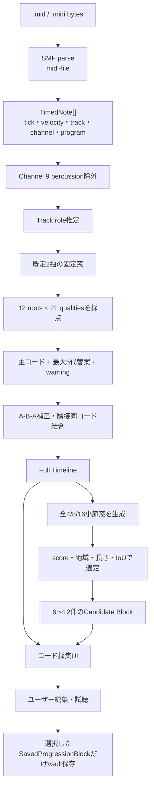
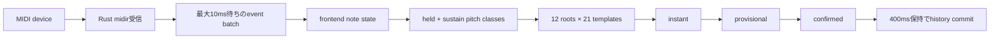

# Loop Vault 現行MIDIコード検出仕様書

- 作成日: 2026-07-25
- 調査対象: `master` commit `22cd15e`
- 対象実装: MIDIファイル解析、および別系統のLive MIDIコード検出
- 本書の基準: 計画書ではなく、上記commit時点の実コード

## 1. 結論

Loop VaultのMIDIファイル解析は、機械学習モデルではなく、ノートの時間・音域・強さ・推定トラック役割を重み付けしてコードテンプレートと照合する、決定的なシンボリック解析である。

通常の「コード採集」画面が使う既定解析器は `legacy-v1` である。これはMIDI全体を既定2拍単位の固定窓に分割し、各窓を21種類のコード品質 × 12ルートに照合する。その後、短い揺れを平滑化し、曲全体から4/8/16小節の再利用候補を選ぶ。

`hybrid-v1`、`legacy-boundary-rerank`、`voice-aware-rerank-v1` も実装されているが、現行の製品UIには解析器を切り替える操作がない。通常画面から解析すると常に `legacy-v1` が使われる。根拠は `src/domain/midi/analysis.ts`、`src/views/CaptureView.tsx`、`src/App.tsx`。

物理鍵盤からリアルタイムにコードを出すLive MIDIは、MIDIファイル解析とは別の検出器である。ファイル解析の時間窓、候補ブロック、Hybrid rerankerは使わない。根拠は `src/domain/liveMidi/*`。

## 2. 対象範囲

本書では次を扱う。

1. `.mid` / `.midi` ファイルを読み込んで曲全体のコードタイムラインを作る処理
2. 4/8/16小節の「使えそうな進行候補」を選ぶ処理
3. 実装済みの任意解析モード
4. 解析結果のUI表示、編集、Vault保存
5. 物理MIDI入力をリアルタイム検出するLive MIDI

オーディオファイルからのコード検出は実装されていない。`.wav`、`.mp3`などを解析してコードへ変換する経路はない。

## 3. 全体フロー



解析入口の実物は次のとおり。

```ts
export const defaultAnalyzerMode = "legacy" as const;
export const analyzerVersion = legacyAnalyzerVersion;

export function analyzeMidi(bytes: Uint8Array, options: AnalyzeMidiOptions = {}): MidiProgressionAnalysis {
  const mode = options.mode ?? defaultAnalyzerMode;
  const analysis = mode === "hybrid-v1"
    ? analyzeMidiHybrid(bytes, options)
    : mode === "voice-aware-rerank-v1"
      ? analyzeMidiVoiceAwareRerank(bytes, options)
    : mode === "legacy-boundary-rerank"
      ? analyzeMidiLegacyBoundaryRerank(bytes, options)
      : analyzeMidiLegacy(bytes, options);
  return { ...analysis, sourceFingerprint: fingerprintMidiBytes(bytes) };
}
```

根拠: `src/domain/midi/analysis.ts`

## 4. 入力とSMFパース

### 4.1 対応形式

| 項目 | 現行動作 |
|---|---|
| UIで受け付ける拡張子 | `.mid`, `.midi`。大文字小文字は区別しない |
| SMF format 0 | 対応 |
| SMF format 1 | 対応 |
| SMF format 2 | 非対応。独立タイムラインを含むためエラー |
| 時間分解能 | PPQ方式のみ |
| SMPTE time division | 非対応。エラー |
| 読み込み方法 | ファイルダイアログ、Tauriのパスdrop、ブラウザFile drop |
| パーサー | `midi-file` |

根拠: `src/domain/midi/rawSmf.ts`、`src/domain/midi/parser.ts`、`src/views/CaptureView.tsx`

`@tonejs/midi` は依存関係にはあるが、このコード検出経路のSMFパースには使っていない。

### 4.2 ノート化

パーサーは各イベントの `deltaTime` を累積し、絶対tickへ変換する。

- `noteOn` かつ velocity > 0: 発音開始
- `noteOff` または velocity = 0 の `noteOn`: 発音終了
- 同一track/channel/pitchの重複発音: FIFOキューで対応
- 終了イベントがないノート: track末尾tickで閉じる
- velocity: 0〜127を0〜1へ正規化
- program: channelごとの直近Program Changeを保持
- Program Change前のノート: program 0、`programExplicit = false`
- Control Change: track、channel、CC番号、tick、0〜1値を保持

出力ノートは `startTick`、`pitch`、`trackIndex`、`channel`、`durationTick` の順で決定的にソートされる。

### 4.3 テンポ・拍子・曲長

- BPM: 最初のTempo Changeを採用し、解析結果では整数へ丸める
- 拍子: 最初のTime Signatureを採用。存在しなければ4/4
- Tempo Change一覧自体は保持するが、コードタイムラインの実時間換算には使わない
- 途中の拍子変更は解析区間へ反映しない
- 曲長: 最後の音符の終了tickを拍へ変換し、最初の拍子の1小節長で切り上げる
- 最低曲長: 1小節

根拠: `src/domain/midi/rawSmf.ts`、`src/domain/midi/parser.ts`、`src/domain/midi/timing.ts`

### 4.4 解析内部型

```ts
export interface TimedNote {
  pitch: number;
  startTick: number;
  durationTick: number;
  velocity: number;
  trackIndex: number;
  channel?: number;
  program?: number;
  programExplicit?: boolean;
}

export interface MidiSongData {
  notes: TimedNote[];
  tempo?: number;
  tempoChanges?: MidiTempoChange[];
  timeSignature?: string;
  ticksPerBeat: number;
  totalBars: number;
  tracks: MidiTrackInfo[];
  controlChanges: MidiControlChange[];
}
```

根拠: `src/domain/midi/types.ts`

## 5. 既定解析器 `legacy-v1`

### 5.1 打楽器除外

標準MIDIのchannel 10に相当する、ゼロ始まりの `channel === 9` はコード証拠から除外する。

さらに、track名が `drum|perc|kick|snare|hat` に一致すると役割が `percussion` になり、そのtrackの重みは0になる。ただし、channel 9以外の打楽器をGM Programだけで判定して除外する処理は、既定legacy解析にはない。

根拠: `src/domain/midi/voices.ts`、`src/domain/midi/parser.ts`、`src/domain/midi/legacy.ts`

### 5.2 Track Role推定

既定解析はvoice単位ではなく、track単位で次の順に役割を決める。

| 条件 | 役割 |
|---|---|
| track名ヒントがpercussion | percussion |
| 平均pitch < 52 かつ平均音価 >= 0.7拍 | bass |
| 同時発音数平均 >= 2.2 または平均音価 >= 1.3拍 | harmony |
| 平均pitch > 67 かつ1小節あたりnote数 > 3 | melody |
| 上記以外 | track名ヒント、なければmixed |

同じtrack内に複数channel・複数楽器が入るSMF format 0では、既定解析はそれらを同一役割として扱う。

根拠: `src/domain/midi/legacy.ts` の `inferTrackRoles()`

### 5.3 解析窓

既定では曲全体を2拍ごとの固定窓へ分ける。APIでは `beatsPerWindow` に1、2、4を指定できるが、コード採集UIは指定しないため2拍になる。

最後の音符位置ではなく `totalBars × beatsPerBar` まで窓を作る。このため最終小節の音が途中で終わっていても、小節末尾まで解析窓が存在する。

根拠: `src/domain/midi/legacy.ts` の `buildWeightedWindows()`、`src/views/CaptureView.tsx`

### 5.4 ノート重み

窓と重なる各ノートに、次を乗算した重みを与える。

```text
weight =
  overlapBeats
  × beatPositionFactor
  × rangeFactor
  × velocityFactor
  × roleFactor
  × simultaneityBonus
```

| 要素 | 値 |
|---|---|
| 小節頭 | 1.5 |
| 整数拍 | 1.2 |
| それ以外 | 0.8 |
| pitch < 48 | 1.4 |
| 48 <= pitch < 72 | 1.0 |
| pitch >= 72 | 0.6 |
| velocity | `0.7 + clamp(velocity) × 0.5` |
| bass role | 1.5 |
| harmony role | 1.3 |
| mixed role | 1.0 |
| melody role | 0.5 |
| percussion role | 0 |
| 窓内に3音以上重なる | 全ノートへ1.2 |

pitch < 60、またはbass roleのノートは、別のbass histogramにも `weight × 1.25` で加算する。

注意: 拍位置係数は個々のノート開始位置ではなく、解析窓の開始位置を基準にしている。

根拠: `src/domain/midi/legacy.ts` の `buildWeightedWindows()`

### 5.5 コードテンプレート

各窓を、12ルート × 21品質の252候補へ照合する。

```text
maj, min, dim, aug,
maj7, min7, dom7, min7b5, dim7,
six, min6, sixNine,
sus2, sus4, dom7sus4, add9,
maj9, min9, dom9, min11, dom13
```

検出結果の `ChordSymbol.tensions` は現状空配列である。9thや11thなどは独立tensionではなく、`quality = "maj9"` のような品質として表現する。

### 5.6 候補採点

各コード候補のraw scoreは次である。

```text
hit / total
- outside / total × 0.12
+ rootWeight × 0.12
+ bassBonus
- extensionPenalty
```

| 要素 | 値 |
|---|---|
| `hit` | テンプレート構成音に属するpitch classの重み |
| `outside` | テンプレート外pitch classの重み |
| `rootWeight` | ルート音の重み / 全重み |
| bassがルート | +0.18 |
| bassがコードトーンだがルート以外 | +0.08 |
| bassがコード外 | -0.04 |
| 5音目以降のテンプレート構成音 | 1音ごとに-0.015 |

score降順、同点時はコードlabel昇順で並べる。最上位を主コードとする。最強bass pitch classがコードトーンでルート以外ならslash bassにする。

証拠がない窓では、前窓のコードをscore 0.2で引き継ぐ。最初の窓にも証拠がなければC majorをscore 0.2で置く。したがって、Full Timelineに明示的な「無音/N.C.」区間は生成しない。

根拠: `src/domain/midi/legacy.ts` の `scoreTemplates()`、`matchWindowWithRankingScore()`

### 5.7 ConfidenceとRanking Score

UI用 `confidence` は0〜1へclampし、小数4桁へ丸める。これは統計的に校正された確率ではなく、ヒューリスティックscoreの表示値である。

候補ブロック順位用の `rankingScore` は内部配列として別に保持する。raw scoreが1以下ならそのまま、1を超えた場合は次へ変換する。

```text
rankingScore = 1 + rawMatchScore × 0.000001
```

これによりUI confidenceが同じ1.0でもraw score順を失わない。一方、raw scoreの差は非常に小さく圧縮されるので、後段のrepeat bonusやdiversity bonusの方が大きく働く。

`rankingScore` は `ChordTimelineItem`、Vault schema、保存JSONへ追加されない。

根拠: `src/domain/midi/legacy.ts`、`src/domain/midi/rankingScore.test.ts`

### 5.8 代替コード

主コード以外から最大5件を選ぶ。単純な上位5件ではなく、次の多様性を順に確保する。

- 最上位
- 主コードと異なるroot
- 同一rootで異なるquality
- slash chord候補
- 残りを全体順位から補充

同一構造の候補は重複させない。

根拠: `src/domain/chordAlternatives.ts`

### 5.9 Warning

| warning | 発生条件 |
|---|---|
| `sparse-evidence` | 窓の全重み < 0.4 |
| `melody-heavy` | melody roleの重み / 全重み > 0.45 |
| `ambiguous-bass` | 1位と2位のraw score差 < 0.05 |

`ambiguous-bass` という名前だが、実際の条件はbass候補差ではなくコード総合scoreの1位・2位差である。

### 5.10 平滑化

1. A-B-Aの3窓で、中央BがAと異なり、B confidenceが直前Aのconfidence + 0.08未満なら、中央をAへ置換する。
2. 同一labelの隣接または重複区間を結合する。
3. 結合時はdurationを加算し、confidenceとrankingScoreを単純平均し、warningを和集合にする。

根拠: `src/domain/midi/legacy.ts` の `smoothTimelineWithRankingScores()`

### 5.11 Key推定

全ノートの `durationTick × velocity` をpitch classごとに集計し、最大pitch classをtonicとする。結果は常に `<note> major` であり、minor、mode、転調は判定しない。

既定legacyのコード候補採点には、このKey推定結果を使わない。Keyは表示・保存用metadataである。

根拠: `src/domain/midi/legacy.ts` の `detectKey()`

## 6. Full Timelineの出力

```ts
export interface ChordTimelineItem {
  eventId?: string;
  bar: number;
  beat: number;
  durationBeats: number;
  chord: ChordSymbol;
  confidence: number;
  alternatives: { chord: ChordSymbol; confidence: number }[];
  warnings: string[];
  voicingMemory?: ChordVoicingMemory;
}
```

```ts
export interface ChordSymbol {
  root: number;
  quality: ChordQuality;
  tensions: Tension[];
  bass?: number;
  label: string;
}
```

根拠: `src/domain/types.ts`

`bar` と `beat` は1始まり。Full Timelineは候補件数制限で切られず、解析した曲全体をUIへ渡す。

## 7. 進行候補の生成

### 7.1 Raw候補

各小節の代表コードは、その小節内でdurationが最長、同じならconfidenceが高いTimeline itemである。該当itemがなければ `N.C.` とする。

曲全体に対して、開始小節を1小節ずつずらしながら、全4/8/16小節窓を生成する。

```text
selectionScore =
  区間内rankingScore平均
  + min(0.25, 完全一致repeatCount × 0.08)
  + min(0.15, 区間内uniqueChordCount × 0.03)
```

表示用confidenceは、Timeline confidence平均へ同じbonusを加えて0〜1へclampする。

### 7.2 ラベル

| label | 条件 |
|---|---|
| `main` | repeatCount > 1 または表示score > 0.78 |
| `intro-like` | 1小節目から開始 |
| `turnaround` | 4小節候補 |
| `variation` | 上記のいずれも付かない |

### 7.3 長尺MIDIの最終選定

全Raw候補を次の順で選ぶ。

1. `selectionScore` 降順へソート
2. 進行要約文字列で重複除去
3. 曲を時間領域へ分け、候補がある各領域から代表を最低1件選ぶ
4. 未選択の4/8/16小節長を、重複条件を満たす範囲で追加
5. IoUが0.6未満の候補で全体順位から補充
6. 枠が残る場合、既選択候補との最大IoUが小さい順に補充

| 曲長 | 最終上限 | 時間領域数 |
|---:|---:|---:|
| 32小節以下 | 6 | 2 |
| 64小節以下 | 8 | 3 |
| 128小節以下 | 10 | 4 |
| 129小節以上 | 12 | 4 |

IoU 0.6は絶対上限ではない。各領域の代表確保と最終補充では、候補不足時に0.6以上の重複を許容する。

同点時は表示confidence降順、開始小節昇順、長さ昇順、終了小節昇順、ID昇順。返却順は単純なscore順位ではなく、地域・長さ多様性を組み込んだ選出順になる。

根拠: `src/domain/midi/legacy.ts`、`src/domain/midi/candidateSelection.ts`

## 8. 実装済みの任意解析モード

| mode | analyzerVersion | 境界 | 主コード | 通常UIから選択 |
|---|---|---|---|---|
| `legacy` | `legacy-v1` | 既定2拍固定 | legacy | 使用中 |
| `hybrid-v1` | `hybrid-symbolic-v1` | 出力はlegacy境界 | legacyを維持 | 不可 |
| `legacy-boundary-rerank` | `legacy-boundary-rerank-v1` | legacy境界 | 明確な優位時だけHybridへ置換 | 不可 |
| `voice-aware-rerank-v1` | `voice-aware-rerank-v1` | legacy境界 | 明確な優位時だけVoice-awareへ置換 | 不可 |

### 8.1 `hybrid-v1`

内部では次を実行する。

- sustainを含むノート正規化
- track role推定
- 装飾音抑制
- 小節頭、拍頭、同時発音burst、bass変化、silence gapによる境界候補
- 1拍以上を基本とするsegment lattice
- 区間ごとのpitch profile
- major/minor Key候補
- 21品質 × 12rootの構造化採点
- 動的計画法による2-pass chord path
- 隣接同コード結合

ただし現行の `analyzeMidiHybrid()` は、最終Full Timelineの主コードと境界をlegacyから保持する。Hybrid結果は代替案とwarning `legacy-primary` に使う。内部Hybrid timelineを返す `timelineFromHybridPipeline()` は診断・テスト用で、通常の解析結果ではない。

根拠: `src/domain/midi/hybrid.ts`、`segmentation.ts`、`candidates.ts`、`decoder.ts`

### 8.2 Hybrid候補の構造化採点

主なcomponentは次のとおり。

```text
templateScore =
  coreCoverage × 0.82
  + importantCoverage × 0.28
  + extensionCoverage × 0.18
  + rootEvidence × 0.32

totalScore =
  templateScore
  + bassCompatibility
  + slashCompatibility
  + keyCompatibility
  - foreignNotePenalty
  - missingCoreTonePenalty
  - ambiguityPenalty
```

1区間あたり通常Top 8候補を残す。decoderはコード変更、弱拍変更、短区間へpenaltyを与え、同一コードと同一rootへ小さなrewardを与える。beamはコードごとに最良stateを残した上で最大24state。

### 8.3 `legacy-boundary-rerank`

legacyの境界と主コードを基準に、各区間だけHybrid候補を再採点する。legacy候補は必ず候補集合へ残す。

主コードを置換するには、異なるHybrid候補が次をすべて満たす必要がある。

| 条件 | 閾値 |
|---|---:|
| legacyに対するscore lead | >= 0.6 |
| core coverage | >= 0.62 |
| root evidence | >= 0.08 |
| foreign note penalty | <= 0.14 |
| missing core tone penalty | <= 0.17 |

置換時warningは `hybrid-reranked`、維持時は `legacy-boundary-retained`。候補ブロック順位にはHybrid totalScoreを混ぜず、基準legacyのrankingScoreを維持する。

根拠: `src/domain/midi/legacyBoundaryReranker.ts`

### 8.4 `voice-aware-rerank-v1`

Voiceは `(trackIndex, channel)` ごとに分割する。channel 9は必ずpercussionとなり、ユーザーoverrideも適用できない。

Voice Roleは次の証拠を合わせて推定する。

- channel rule
- 明示されたGM Program
- track名
- median pitch、pitch range、polyphony、同時onset率
- note密度、平均音価、sustain
- 全体に対するlowest/highest voiceの割合
- stepwise motion、同pitch class反復

最上位role scoreが0.42未満、または2位との差が0.08未満なら `mixed` へfallbackする。

| Voice Role | root | bass | quality | tension |
|---|---:|---:|---:|---:|
| bass | 0.90 | 1.00 | 0.25 | 0.00 |
| harmony | 0.65 | 0.35 | 1.00 | 0.55 |
| pad | 0.60 | 0.20 | 0.80 | 0.55 |
| melody | 0.15 | 0.00 | 0.22 | 0.35 |
| mixed | 0.35 | 0.15 | 0.45 | 0.25 |
| percussion | 0.00 | 0.00 | 0.00 | 0.00 |

低音域ではroot/bass寄与を増やし、quality/tension寄与を下げる。最終置換判定は `legacy-boundary-rerank` と同じ保守的閾値を使う。

通常UIは `analysisInput` を渡さず、modeも指定しない。したがって、Voice-aware解析とVoice選択・Role overrideは製品画面では現在使われていない。

根拠: `src/domain/midi/voices.ts`、`voiceRoles.ts`、`voiceProfiles.ts`、`voiceAwareReranker.ts`、`src/App.tsx`

## 9. UI・状態管理・保存

### 9.1 一時解析状態

```ts
export interface AnalysisState {
  status: AnalysisStatus;
  result?: MidiProgressionAnalysis;
  error?: string;
  sourceData?: MidiSongData;
  sourceVoices?: Voice[];
}
```

`analyzeMidiBytes()` は同期的に次を行う。

1. statusを`analyzing`
2. `analyzeMidi(bytes, options)`
3. 同じbytesをもう一度 `parseMidi()`
4. source voicing抽出用にVoiceを構築・Role注釈
5. statusを`done`、またはcatchして`error`

解析本体はWeb Worker、Rust worker、cancel tokenを使わない。長いMIDIではfrontendのJavaScript threadを占有する可能性がある。

根拠: `src/store/vaultStore.ts`

### 9.2 UIでできること

- MIDIファイル選択またはdrag & drop
- 小節数、BPM、拍子の確認
- SongMiniMapで全体位置を確認
- 4/8/16小節Candidateの確認
- Full Timelineの確認
- piano / electric pianoでコードまたは進行を試聴
- Candidate内コードの編集、追加、代替案選択
- 新規Ideaとして保存
- 既存Ideaへ追記
- memoまたは進行文字列をコピー

根拠: `src/views/CaptureView.tsx`

### 9.3 永続化境界

`MidiProgressionAnalysis`、Full Timeline全体、未採用Candidate一覧はVaultへ自動保存しない。Zustandの一時状態だけに置く。

ユーザーが保存を選んだCandidateだけを `SavedProgressionBlock` へ変換し、既存の `applyVaultChange()` とautosave経路で保存する。

保存時には次が加わる。

- source file name
- MIDI bytesのSHA-256 fingerprint
- source start/end beat
- start/end/length bars
- detected key、BPM、拍子
- warningを結合したmemo
- analyzer version
- `sourceWeightsVersion: "phase3.6-v1"`
- user edited / verified
- 元MIDIから抽出できた各コードのvoicing

`selectionScore` と内部rankingScoreは保存しない。

根拠: `src/store/vaultStore.ts`、`src/domain/midi/fingerprint.ts`、`src/domain/schema.ts`

### 9.4 補正ログ

ユーザーが検出コードを修正した場合、設定が有効かつTauri環境なら、AppData配下の次へJSON Linesで追記する。

```text
loopvault/analysis-feedback.jsonl
```

ログは評価・将来の補正昇格用であり、現行の通常解析がその場で学習して重みを変えることはない。MIDI bytesと絶対ファイルパスは補正ログへ保存しない。

根拠: `src/domain/midi/feedback.ts`、`analysisFeedback.ts`、`src/storage/analysisFeedbackStorage.ts`

## 10. 決定性

ファイル解析domainはReact、Zustand、Tauri APIをimportしない。同じbytesと同じoptionsに対し、同じ結果を返すように作られている。

- `Math.random()`を使わない
- 現在時刻を使わない
- `analyzedAt` は常に `1970-01-01T00:00:00.000Z`
- score同点時のsort条件を固定
- source fingerprintは純TypeScript実装のSHA-256

`fileName` と `sourceAssetId` はmetadataとして結果に入るが、コード判定scoreには影響しない。

## 11. Live MIDIコード検出

Live MIDIはファイル解析とは独立した低遅延経路である。



### 11.1 Live採点

発音中のpitch classが2種類以下ならコード名を出さず、ノート名表示になる。3種類以上で21品質 × 12rootを採点し、上位3件を作る。

```text
score =
  requiredCoverage × 0.68
  + importantCoverage × 0.20
  + optionalCoverage × 0.13
  + bassBonus
  - foreignRatio × 0.45
  - missingRequiredRatio × 0.50
  - complexityPenalty
```

- held noteがあれば最下音、なければsustain中の最下音をbassとする
- bassがrootなら+0.12
- bassがroot以外のコードトーンなら+0.035、slash chordにする
- 最上位score < 0.48ならコード確定せずノート表示
- 最大2件の代替コードを返す

根拠: `src/domain/liveMidi/liveChordDetector.ts`、`liveBass.ts`

### 11.2 表示安定化

| 定数 | 値 |
|---|---:|
| 音が増える方向のgather | 40ms |
| 通常切替のstable | 50ms |
| 部分release grace | 200ms |
| 全release | 180ms |
| bass grace | 120ms。定数はあるが現行stabilizerから未参照 |
| history commit | 400ms |
| 高速仮表示の押鍵span上限 | 30ms |
| 高速仮表示のTop1-Top2 margin | 0.03 |

3 pitch class以上、押鍵span 30ms以内、score margin 0.03以上、held bassが候補bassと一致する場合はprovisionalを早く表示する。音が減る方向はrelease graceを長くしてちらつきを抑える。固定intervalではなく、次のprovisional・confirmed・history deadlineに対する単一timerを使う。

Rust側batch workerは最初のeventを最大10ms待ち、その時点でqueueにあるeventをまとめてemitする。

根拠: `src/domain/liveMidi/constants.ts`、`provisionalChord.ts`、`chordStabilizer.ts`、`src/liveMidi/liveMidiStore.ts`、`src-tauri/src/live_midi/event_batch.rs`

## 12. テストと評価基盤

MIDIファイル解析配下には、通常テスト、評価テストを合わせて38個の `.test.ts` がある。主な検証範囲は次のとおり。

- format 0/1、tempo、拍子、program、sustain、percussion除外
- legacy解析の決定性、confidence、rankingScore
- 4/8/16小節候補、地域分散、IoU、240小節fixture
- Hybridのprofile、segmentation、candidate score、decoder、merge
- legacy-boundary rerankerの置換条件
- Voice構築、GM role、role推定、voice-aware score
- correction cost、feedback、SHA-256 fingerprint
- synthetic/real MIDI評価schema、privacy guard、review queue

Live MIDIにはnote state、detector、provisional、stabilizer、history importのテストが別にある。

本書作成時に `npm test -- src/domain/midi` を実行し、38ファイル・166テストがすべて通過した。

評価・診断CLIは `package.json` にあり、主に次を提供する。

- `npm run eval:midi`
- `npm run eval:midi:compare`
- `npm run eval:midi:rerank`
- `npm run eval:midi:datasets`
- `npm run eval:midi:voice-aware`
- `npm run diagnose:midi-failures`
- `npm run ablate:midi`
- `npm run benchmark:midi`
- `npm run benchmark:live-midi`

## 13. 現行仕様上の制約・既知の課題

1. **製品既定はlegacy固定**

   Hybrid、legacy-boundary rerank、Voice-awareは通常UIから選べない。

2. **既定境界は2拍固定**

   実装済みのadaptive segmentationは通常製品結果の主境界になっていない。

3. **Key推定が単純**

   最大pitch classを常にmajorとして返す。minor、mode、転調を扱わない。

4. **途中テンポ・拍子変更をコード位置へ反映しない**

   最初のTempo/Time Signatureだけを結果metadataと小節計算に使う。

5. **無音をN.C.としてTimelineに出さない**

   証拠がない窓は前コード、またはC majorを低confidenceで補う。

6. **format 0の役割分離が粗い**

   legacyはtrack単位Roleなので、同一trackの複数channelを区別しない。

7. **Confidenceは確率ではない**

   0〜1へclampしたヒューリスティックscoreである。

8. **既定legacyはSustain CCを音価へ反映しない**

   sustainを含む正規化はHybrid/Voice-aware側にある。

9. **同期解析**

   ファイル解析はfrontend threadで同期実行し、cancelや進捗表示がない。

10. **同じMIDIを保存時voicing用に再parseする**

    検出後、storeがsource voiceを作るため同じbytesをもう一度parseする。

11. **tensions配列を活用していない**

    検出コードは拡張音をquality名として持ち、`tensions` は空配列になる。

12. **補正ログをオンライン学習へ使わない**

    ユーザー修正は記録されるが、次の通常解析へ自動反映されない。

13. **Candidate IoU 0.6は保証上限ではない**

    地域代表確保や候補不足時の補充では閾値以上を選ぶことがある。

14. **`debug` optionは公開型にあるが解析分岐で使われていない**

    診断出力を返す公開APIにはなっていない。

15. **オーディオ解析は未実装**

    現行コード検出の入力はSMF MIDIまたはLive MIDI eventに限られる。

## 14. 主要実装ファイル

| ファイル | 役割 |
|---|---|
| `src/domain/midi/analysis.ts` | 解析modeの入口、既定mode、fingerprint付与 |
| `src/domain/midi/rawSmf.ts` | SMF eventの低レベルparse |
| `src/domain/midi/parser.ts` | `MidiSongData`構築、track名Role hint、曲長 |
| `src/domain/midi/legacy.ts` | 現行製品の既定コード検出・平滑化・block生成 |
| `src/domain/midi/candidateSelection.ts` | 長尺対応の地域・長さ・IoU候補選定 |
| `src/domain/chordAlternatives.ts` | 代替コードの多様性選定 |
| `src/domain/midi/hybrid.ts` | Hybrid pipelineとlegacy-primary出力 |
| `src/domain/midi/candidates.ts` | 構造化Chord candidate score |
| `src/domain/midi/segmentation.ts` | Adaptive boundaryとsegment lattice |
| `src/domain/midi/decoder.ts` | 2-pass dynamic programming |
| `src/domain/midi/legacyBoundaryReranker.ts` | legacy境界内の保守的rerank |
| `src/domain/midi/voices.ts` | `(track, channel)` Voice構築、channel 9除外 |
| `src/domain/midi/voiceRoles.ts` | Voice Role推定 |
| `src/domain/midi/voiceProfiles.ts` | Role別root/bass/quality/tension証拠 |
| `src/domain/midi/voiceAwareReranker.ts` | Voice-aware rerank |
| `src/store/vaultStore.ts` | 一時解析state、保存変換、source voicing抽出 |
| `src/views/CaptureView.tsx` | MIDI入力、表示、編集、試聴、保存UI |
| `src/domain/liveMidi/liveChordDetector.ts` | Live MIDIの瞬時コード採点 |
| `src/domain/liveMidi/chordStabilizer.ts` | provisional/confirmed表示安定化 |
| `src/liveMidi/liveMidiStore.ts` | event batch、deadline、history、遅延計測 |
| `src-tauri/src/live_midi/event_batch.rs` | Rust MIDI event batch |
