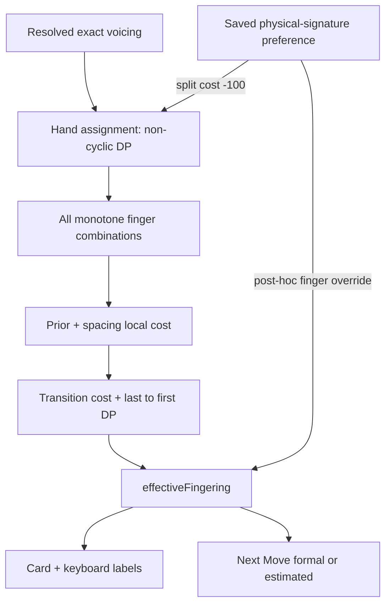

<!-- phase-id: 11.0 -->
# P11-12 — Fingering Ranker Baseline Audit

## 状態・範囲

**BASELINE AUDIT COMPLETE / PRODUCT LOGIC UNCHANGED。改善実装・weight fitting・新しいGold運指は無し。**

製品基準HEAD: `94dae5b6de248a6bcfb226e32b3bec6980815d51`。専用branch: `audit/p11-12-fingering-ranker`。直前のテスト削減監査・既存未追跡診断は変更していない。Phase 11 READMEのP11-11完了が出発点であり、HANDOFFのP11-10中心の説明より実コードを優先した。新規worktreeは作らず既存D-drive checkoutを使用した。

公開合成データのみ。外部Fingering Datasetの取得・利用、private Vault/MIDI、学習、閾値追加、source notesの変更は行っていない。本レポートの具体運指は**観測結果**であり、正解として新規assertしていない。MIDI数値は全て診断用に生成した公開合成値。音名のC3はMIDI48として記述する（製品UIのFL表記とはoctave名が異なる）。

診断実行・Gateのcommit対応は末尾「検証記録」を参照。FULL、EXE、merge、push、tag、releaseは本Stageで実施しない。

## A. Architecture

| 段階 | 実ファイル / 関数 | 現行動作 |
| --- | --- | --- |
| Resolved Voicing | `src/domain/progressionVoicingPractice/voicingResolution.ts` / `resolveProgressionPracticeVoicings` | 選択Sourceとshapeからexact practice notesを解決。reference bassはpractice targetと別の場合がある |
| Hand Assignment | `src/voicingPractice/fingeringDisplay.ts:36` / `assignPracticeHandsAcrossProgression` | explicit手配分を保持。固定Sourceで配分が無い場合はsorted notesのbounded splitをDPで選ぶ。**非cyclic** |
| UI adapter | `src/views/ProgressionVoicingPracticeView.tsx:1920` / `rankFingeringsForHand` | 各手ごとに全snapshotを走査。空の手はイベントから除外。chord/family/pitches/idのみ渡し、timeやRangeやsaved fingersは渡さない |
| Candidate | `src/domain/progressionFingering.ts:18` / `generateFingeringCandidates` | unique MIDIを昇順化、N fingersを5から選ぶ。RH昇順、LH降順。localCostでsort |
| Per-event | 同`:141–164` / `preferredFingers`, `priorCost`, `spacingCost` | guide priorとの差×10 + 正規化した音間/指間比率差 |
| Transition | 同`:104` / `transitionCost` | 共通pitchの指交替、同指pitch移動、指の追加/離脱 |
| Cyclic | 同`:35` / `rankCyclicFingerings` | first候補を列挙するbounded DP。最後にlast→first costを足す |
| Personal | `src/voicingPractice/fingeringPreferences.ts` | app-local preference、hand+absolute pitches signature、最大256件。Vault外 |
| Effective | View`:1941` / `effectiveFingering` | supported suggestionのsignatureにsaved entryがあればfingersを上書き |
| UI | View`:1950` / `addKeyboardFingerLabels`, `fingerSummary`, `HandVoicing` | effectiveとpitchesを同じindexで表示。L5への強制変換無し |
| Next Move | View`:610` → `src/voicingPractice/nextMove.ts:72` / `computeNextMoves` | 両側のeffectiveと手配分が一致する時formal。片側不足時はestimated alignment |



**二つのoptimizerを区別する。** Hand Assignmentには手のmidpoint/音域/保存signatureのcostがある。指rankerには手全体のposition stateや保存anchorは無い。手配分の結果が変わるとrankerの入力も変わる。

## B. Current Cost Model

### 指ranker

| Feature | 実装済み | Hard / Soft | Weight / priority | 対象 |
| --- | --- | --- | --- | --- |
| finger prior | YES | Soft（数値上非常に強い） | `10 × Σ abs(finger-preferred)` | local |
| finger span | PARTIAL | Soft | normalized finger interval ratio差、係数1 | local。指ごとの実距離ではない |
| pitch interval | YES / relative only | Soft | `(pitch-min)/max(1,span)`と指比率の絶対差合計 | local。絶対span上限ではない |
| same-finger movement | YES | Soft | `min(2, abs(pitch-priorPitch)×0.125)` | 非common pitchのtransition |
| hand translation / position state | **NOT IMPLEMENTED** | — | 指ごとの差は加算するが、手全体の移動state無し | 指ranker。前段は別表 |
| common-tone retention | YES | Soft | 同pitch同finger=0、異finger=0.75 | transition。保持強制ではない |
| repeated note | YES | Soft | 上記common-tone分岐を共有 | transition |
| black/white key geometry | **NOT IMPLEMENTED** | — | 黒鍵判定/鍵盤奥行/指別penalty無し | triad identityのpitch-class利用とは別 |
| simultaneous finger crossing | 排除 | Hard | RH厳密昇順/LH厳密降順、重複finger無し | candidate構造 |
| crossing across events | **NOT IMPLEMENTED** | — | thumb-under等の遷移模型無し | transition |
| expansion/contraction | 専用項目は **NOT IMPLEMENTED** | — | spacingと各finger pitch差の間接効果のみ | 開く/閉じる方向別cost無し |
| next chord preparation | PARTIAL | Soft | 後続edgeがDP最小化に参加 | 準備姿勢/先読み時間state無し |
| previous transition | YES | Soft | transitionCost | incoming edge |
| next transition | YES | Soft | transitionCost | outgoing edge |
| tempo / BPM | **NOT IMPLEMENTED** | — | 入力型に無し | view adapterも渡さない |
| IOI | **NOT IMPLEMENTED** | — | onset/duration無し | rest間隔も渡さない |
| loop boundary | YES（全候補supported時） | Soft | `last→first transitionCost` | cyclic DP |
| saved/user fingering anchor | **NOT IMPLEMENTED** | — | ranker入力に無し | effectiveで上書き |
| finger added / removed | YES | Soft | 追加finger=0.5、前fingerの離脱=0.5 | transition |
| hand assignment | 前段 | Hard + Soft | 下表 | rankerの担当音を決める |

同pitchが見つかるとcommon-tone分岐で`return`するため、その音にsame-finger距離costを重ねていない。候補sortはlocalCost→finger配列辞書順。DP tie-breakはcandidate index配列辞書順。

preferred: RH N1 `[1]`、N2 `[1,5]`、N4 `[1,2,3,5]`、N5 `[1,2,3,4,5]`。LHはN1 `[5]`、N2 `[5,1]`、N4 `[5,3,2,1]`、N5 `[5,4,3,2,1]`。N3はgeneric RH `[1,3,5]` / LH `[5,3,1]`。maj/min triad identityと最低pitchが対応する時のみ、RH first inversion `[1,2,5]`、LH second inversion `[5,2,1]`等のguide priorへ変わる。family値自体はpreferred計算に使っていない。

### 前段の手配分（finger costと混同しない）

`fingeringDisplay.ts:69–122`:

- explicit `leftHandNotes/rightHandNotes` はそのまま保持。真正left-hand originは全noteをLH。
- 固定Sourceの未配分notesはLH/RH各5音以下の連続splitだけ列挙。重複/不正pitchは拒否。
- local: `LH音数×0.35`、bassがRHにあると`+20`。
- 各手: `max(0,span-12)×1.4 + span×0.08 + abs(midpoint-center)×0.08`。centerはLH49/RH68。
- 候補最小finger localCostの`×0.02`（unsupportedなら`+1000`）。saved signature一致は`-100`。
- 隣接手のmidpoint差`×0.08`。**last→firstは加算しない**。空/unsupported箇所で連続区間を分ける。
- 12は既存soft costの定数であり、今回新設した身体的validity thresholdではない。

## C. Candidate Coverage

全候補の`enumerationBeforeLocalSort`、local順、fingers、prior/spacing/total、selectedはlocal-only `candidate-coverage.json`へ出力した。生成候補は全組合せであり、permutationではない。

| Hand | N | 実測min / mean / max | 基本shapeの最終選択 | empty |
| --- | ---: | --- | --- | ---: |
| left | 1 | 5 / 5 / 5 | `[5]` | 0/864 |
| left | 2 | 10 / 10 / 10 | `[5, 1]` | 0/864 |
| left | 3 | 10 / 10 / 10 | `[5, 3, 1]` | 0/864 |
| left | 4 | 5 / 5 / 5 | `[5, 3, 2, 1]` | 0/864 |
| left | 5 | 1 / 1 / 1 | `[5, 4, 3, 2, 1]` | 0/864 |
| right | 1 | 5 / 5 / 5 | `[1]` | 0/864 |
| right | 2 | 10 / 10 / 10 | `[1, 5]` | 0/864 |
| right | 3 | 10 / 10 / 10 | `[1, 3, 5]` | 0/864 |
| right | 4 | 5 / 5 / 5 | `[1, 2, 3, 5]` | 0/864 |
| right | 5 | 1 / 1 / 1 | `[1, 2, 3, 4, 5]` | 0/864 |

候補集合（低pitch→高pitch順。LHは右欄配列を各々reverseした集合）:

| N | RH全候補（local sort前） |
| --- | --- |
| 1 | `1` / `2` / `3` / `4` / `5` |
| 2 | `12` / `13` / `14` / `15` / `23` / `24` / `25` / `34` / `35` / `45` |
| 3 | `123` / `124` / `125` / `134` / `135` / `145` / `234` / `235` / `245` / `345` |
| 4 | `1234` / `1235` / `1245` / `1345` / `2345` |
| 5 | `12345` |

候補-empty率はvalid 1〜5 unique-note inputの範囲で0/8640。空配列は`no-keys`、6 unique notesは`too-many-keys`、小数/範囲外は`invalid-pitches`。同一pitchの重複はunique化するので「2音入力なら必ず2指」ではない。

## D. Single-note Baseline

**LH単音はL5しか生成しないのではない。5候補がある。** local順とcostは`L5=0, L4=10, L3=20, L2=30, L1=40`。RHは`R1=0, R2=10, R3=20, R4=30, R5=40`。単音spacingは0。

| LH音列（公開合成MIDI） | 選択 | transition costs（最後はwrap） |
| --- | --- | --- |
| `[[48], [48], [48], [48]]` | `[[5], [5], [5], [5]]` | `[0, 0, 0, 0]` |
| `[[48], [50], [52], [53]]` | `[[5], [5], [5], [5]]` | `[0.25, 0.25, 0.125, 0.625]` |
| `[[53], [52], [50], [48]]` | `[[5], [5], [5], [5]]` | `[0.125, 0.25, 0.25, 0.625]` |
| `[[48], [49], [50], [51], [52]]` | `[[5], [5], [5], [5], [5]]` | `[0.125, 0.125, 0.125, 0.125, 0.5]` |
| `[[48], [55]]` | `[[5], [5]]` | `[0.875, 0.875]` |
| `[[48], [60]]` | `[[5], [5]]` | `[1.5, 1.5]` |
| `[[48], [60], [48], [60]]` | `[[5], [5], [5], [5]]` | `[1.5, 1.5, 1.5, 1.5]` |

RHも同じinterval列を12半音上で測定し、全てR1、transition costは同じ。手ごとの単音864イベントでLH L5=864、他0 / RH R1=864、他0。これは分布であり品質KPIではない。単音sequenceは全候補を保持したまま、距離costよりprior差が支配する。

## E. Multi-note Baseline

次表は各shapeのexact MIDI、選択、local score。全finger候補ごとのscore内訳はJSONに保持。1音でもblack shapeは黒鍵を使用する。inversion形状の表だけでchord identityを仮定せず、identity付きtriadを別表に分けた。

| shape / N | LH notes → selected / local cost | RH notes → selected / local cost |
| --- | --- | --- |
| white / 1 | `[48]` → `[5]` / 0.000000 | `[60]` → `[1]` / 0.000000 |
| white / 2 | `[48, 50]` → `[5, 1]` / 0.000000 | `[60, 62]` → `[1, 5]` / 0.000000 |
| white / 3 | `[48, 50, 52]` → `[5, 3, 1]` / 0.000000 | `[60, 62, 64]` → `[1, 3, 5]` / 0.000000 |
| white / 4 | `[48, 50, 52, 55]` → `[5, 3, 2, 1]` / 0.107143 | `[60, 62, 64, 67]` → `[1, 2, 3, 5]` / 0.107143 |
| white / 5 | `[48, 50, 52, 55, 57]` → `[5, 4, 3, 2, 1]` / 0.111111 | `[60, 62, 64, 67, 69]` → `[1, 2, 3, 4, 5]` / 0.111111 |
| black / 1 | `[49]` → `[5]` / 0.000000 | `[61]` → `[1]` / 0.000000 |
| black / 2 | `[49, 51]` → `[5, 1]` / 0.000000 | `[61, 63]` → `[1, 5]` / 0.000000 |
| black / 3 | `[49, 51, 54]` → `[5, 3, 1]` / 0.100000 | `[61, 63, 66]` → `[1, 3, 5]` / 0.100000 |
| black / 4 | `[49, 51, 54, 56]` → `[5, 3, 2, 1]` / 0.250000 | `[61, 63, 66, 68]` → `[1, 2, 3, 5]` / 0.250000 |
| black / 5 | `[49, 51, 54, 56, 58]` → `[5, 4, 3, 2, 1]` / 0.111111 | `[61, 63, 66, 68, 70]` → `[1, 2, 3, 4, 5]` / 0.111111 |
| cluster / 1 | `[48]` → `[5]` / 0.000000 | `[60]` → `[1]` / 0.000000 |
| cluster / 2 | `[48, 49]` → `[5, 1]` / 0.000000 | `[60, 61]` → `[1, 5]` / 0.000000 |
| cluster / 3 | `[48, 49, 50]` → `[5, 3, 1]` / 0.000000 | `[60, 61, 62]` → `[1, 3, 5]` / 0.000000 |
| cluster / 4 | `[48, 49, 50, 51]` → `[5, 3, 2, 1]` / 0.250000 | `[60, 61, 62, 63]` → `[1, 2, 3, 5]` / 0.250000 |
| cluster / 5 | `[48, 49, 50, 51, 52]` → `[5, 4, 3, 2, 1]` / 0.000000 | `[60, 61, 62, 63, 64]` → `[1, 2, 3, 4, 5]` / 0.000000 |
| wide / 1 | `[48]` → `[5]` / 0.000000 | `[60]` → `[1]` / 0.000000 |
| wide / 2 | `[48, 55]` → `[5, 1]` / 0.000000 | `[60, 67]` → `[1, 5]` / 0.000000 |
| wide / 3 | `[48, 55, 60]` → `[5, 3, 1]` / 0.083333 | `[60, 67, 72]` → `[1, 3, 5]` / 0.083333 |
| wide / 4 | `[48, 55, 60, 67]` → `[5, 3, 2, 1]` / 0.250000 | `[60, 67, 72, 79]` → `[1, 2, 3, 5]` / 0.250000 |
| wide / 5 | `[48, 55, 60, 67, 76]` → `[5, 4, 3, 2, 1]` / 0.142857 | `[60, 67, 72, 79, 88]` → `[1, 2, 3, 4, 5]` / 0.142857 |
| inversion / 1 | `[48]` → `[5]` / 0.000000 | `[60]` → `[1]` / 0.000000 |
| inversion / 2 | `[48, 51]` → `[5, 1]` / 0.000000 | `[60, 63]` → `[1, 5]` / 0.000000 |
| inversion / 3 | `[48, 51, 56]` → `[5, 3, 1]` / 0.125000 | `[60, 63, 68]` → `[1, 3, 5]` / 0.125000 |
| inversion / 4 | `[48, 51, 56, 60]` → `[5, 3, 2, 1]` / 0.166667 | `[60, 63, 68, 72]` → `[1, 2, 3, 5]` / 0.166667 |
| inversion / 5 | `[48, 51, 56, 60, 63]` → `[5, 4, 3, 2, 1]` / 0.133333 | `[60, 63, 68, 72, 75]` → `[1, 2, 3, 4, 5]` / 0.133333 |
| open / 1 | `[48]` → `[5]` / 0.000000 | `[60]` → `[1]` / 0.000000 |
| open / 2 | `[48, 55]` → `[5, 1]` / 0.000000 | `[60, 67]` → `[1, 5]` / 0.000000 |
| open / 3 | `[48, 55, 64]` → `[5, 3, 1]` / 0.062500 | `[60, 67, 76]` → `[1, 3, 5]` / 0.062500 |
| open / 4 | `[48, 55, 64, 69]` → `[5, 3, 2, 1]` / 0.345238 | `[60, 67, 76, 81]` → `[1, 2, 3, 5]` / 0.345238 |
| open / 5 | `[48, 55, 64, 69, 76]` → `[5, 4, 3, 2, 1]` / 0.071429 | `[60, 67, 76, 81, 88]` → `[1, 2, 3, 4, 5]` / 0.071429 |

| identity付きtriad | notes | selected | reason |
| --- | --- | --- | --- |
| triad-left-0 | `[48, 52, 55]` | `[5, 3, 1]` | guide-triad-root |
| triad-left-1 | `[52, 55, 60]` | `[5, 3, 1]` | guide-triad-first |
| triad-left-2 | `[55, 60, 64]` | `[5, 2, 1]` | guide-triad-second |
| triad-right-0 | `[60, 64, 67]` | `[1, 3, 5]` | guide-triad-root |
| triad-right-1 | `[64, 67, 72]` | `[1, 2, 5]` | guide-triad-first |
| triad-right-2 | `[67, 72, 76]` | `[1, 3, 5]` | guide-triad-second |

### 物理的整合性の意味と限界

53,568候補 / 8,640選択で、既存`isValidFingering`違反0。finger重複、欠損、同時音のfinger順序逆転、1〜5範囲外0。別途360ケースの固定Source手配分で、note集合の不一致 / 片手6音以上 / `max(LH)>min(RH)` 0。

一方、観測最大spanは**30半音でもranker supported**。これを新しい10/12/13半音閾値でFAIL扱いしていない。指rankerのvalidityは生体力学を保証せず、5音でも候補1本ならそれを返す。二音のspacingCostは端点比率だけなので、隣接音と広い二音のlocal scoreが同じになる。手配分の既存soft span penaltyと指rankerのhard validityを混同しない。

## F. Context Sensitivity

### IOI / BPM

同じ720比較ケース（hand+音列のdistinct数696）をIOI 0.25/1/4拍（120 BPMで125/500/2000ms）、別途BPM60/120/240で比較。selected変更0/720、score変更0/720。高速/低速の安全閾値ではなく時間入力サンプルである。

**CURRENT RANKER IS IOI-INVARIANT。** BPMにも不変。入力型に時間欄がなく、Viewも渡さない。診断では追加fieldとして渡しても読まれないことを確認した。

### 前後の変更

同じtarget（各進行のevent1）を維持し、previousのみ / nextのみを別の二音へ変更。selected変更はどちらも0/720。incoming/outgoingのcost関数は実行され、式も存在する。**context-freeな実装という意味ではなく、測定corpus内ではlocal最小から選択が動かなかった**という結果。あらゆる入力で不変との証明ではない。

### White / Black

WW/WB/BW/BBの代表bass/pitchを全て7半音移動でmatched比較。単音は両手とも各edge0.875、三音は各edge2.5、selected/local costも同一。三音の分類は最低音の色遷移であり、全構成音が同色という意味ではない。chromatic root offsetsも全12通り実行。black-key geometry軸は**NOT IMPLEMENTED**。黒鍵thumbの一律禁止を追加していない。

### Common tone / expansion / translation

| LH sequence | shared pitches | selected | edge cost forward / back |
| --- | ---: | --- | --- |
| `[[48, 52, 55], [48, 53, 57]]` | 1 | `[[5, 3, 1], [5, 3, 1]]` | 0.375 / 0.375 |
| `[[48, 52, 55], [48, 52, 57]]` | 2 | `[[5, 3, 1], [5, 3, 1]]` | 0.25 / 0.25 |
| `[[48, 52, 55], [50, 53, 57]]` | 0 | `[[5, 3, 1], [5, 3, 1]]` | 0.625 / 0.625 |
| `[[48, 52, 55], [48, 52, 55]]` | 3 | `[[5, 3, 1], [5, 3, 1]]` | 0 / 0 |
| `[[48, 50, 52], [48, 55, 64]]` | 1 | `[[5, 3, 1], [5, 3, 1]]` | 2.125 / 2.125 |
| `[[48, 55, 64], [48, 50, 52]]` | 1 | `[[5, 3, 1], [5, 3, 1]]` | 2.125 / 2.125 |
| `[[48, 52, 55], [53, 57, 60]]` | 0 | `[[5, 3, 1], [5, 3, 1]]` | 1.875 / 1.875 |

RHも同じ構造を測定済み。common pitch保持は専用cost0/0.75がある。narrow→wideとwide→narrowは既存の各指差として計算され、方向別のexpansion模型は無い。同じshapeの+5半音translationでは3指分が加算される（1.875/edge）。手全体一移動として割引するstateは無い。

### Single ↔ Chord（重要な接続例）

左右で1→2/3/4、2/3/4→1を、単音がchordの最低音の場合と最高音の場合の双方で実行した。全候補・両方向costは`transition-metrics.json`。

- LH `[52] → [48,50,52]`: 選択は`[5] → [5,3,1]`。共通52がL5→L1へ変わる。選択状態の往復transition=3.5。
- 単音L1なら共通52を保持し往復transition=2まで下がるが、local prior=40が加わる。L5のlocal=0が勝つ。
- RHも`[64] → [60,62,64]`でR1→R5。同じ比較になる。

**接続の保持を優先する別候補は既に存在するが、現costでは選ばれない**。これは「L1/R5が正解」「現運指が演奏不能」というGold判定ではない。具体運指を固定せずpriorとtransitionのトレードオフを観測した。

## G. Cyclic

`rankCyclicFingerings:76–78`でlast→firstを実際に加算する。二イベントnamed casesは全candidate pairの総costを列挙し、public rankerの選択が最小costと一致することを診断testで確認した。

720 matched caseでwrap costが正のもの720/720。例LH step-upはlocal=0、forward=0.625、wrap=0.625、全体=1.25。hypothetical non-cyclicでは0.625。選択指はどちらも5555。全720例でcyclic/openの選択差0、costにはwrap分の差がある。

診断のopen-chain DPは比較用で、製品への代替実装・promotionではない。注意点:

- 1イベントは自身へのedgeも計算（同一finger/pitchなら0）。
- **一つでもunavailableが混じると、全体が各eventのlocal候補0へfallback**。supportedな隣接部分だけをcyclic最適化する設計ではない。
- UI adapterは空の手を除外する。手の休符や不在時間を飛び越した「次の有音イベント」が隣接になる。時間cost無しと組み合わさる制約。

## H. Range

実Viewをjsdomで操作し、fullを基準にone-card / middle / reverse-normalizedの3操作を比較。共通の観測event1でeffective変更0/3。全snapshotのranker入力とuseMemo依存にRangeは入っていない。Range変更で既存の候補やfixed notesを再最適化しない契約通り。

このUI測定は停止中のcard選択。再生中Range終端でのaudio、WebView実描画の性能は対象外。Next Moveの行先は現在/次indexのprojectionに従うため、Rangeを切り出して別の運指を最適化したことにはならない。

## I. Saved Fingering

**B: ranker後のpost-hoc override。A: anchor-aware rankerではない。**

explicit手配分のGenerated公開fixtureでAuto→Saved→Autoを実行。保存対象のRH `[65,69]`へ既存候補から`[1,4]`を選び、保存・reloadで同一、reset後に全projectionが元へ戻った。前/次Autoのsuggestion変更0/2。保存値はGoldではなく、任意のvalidなユーザー指定の役割である。

ただし副作用を分ける必要がある。未配分Sourceでは保存signatureが手配分costを-100し、合成例の対象eventを`LH[38,48]/RH[65,69]`から`LH[38]/RH[48,65,69]`へ変更した（1/4イベント）。notesは同じ。他イベントの変化はこの例では0。**保存の有無が前段に影響することと、saved fingerを固定条件に前後Autoを最適化することは別**。後者は未実装。

## J. Source

同じ生成resolved notesをそのまま保存した音 / 元MIDI / カスタム相当のdetached snapshotに入れ、実resolverを通した。identity、note集合、contextを合わせた代表4進行では3固定Source同士の手配分とrecommendationが一致。同じ手配分/pitches/chordでfamilyだけを替えたranker出力も一致。

ただしGeneratedのexplicit配分と固定Sourceのdynamic配分は異なり得る。8chord labels×Teacher/Core×Color ON/OFF×Open ON/OFFの**64 matched比較でnotesは64/64一致、手配分差8/64**。

例、Cmaj7 `[48,59,64,67]`:

| Source | LH | RH | fingers |
| --- | --- | --- | --- |
| Generated（explicit） | 48,59 | 64,67 | LH51 / RH15 |
| 元MIDI相当（dynamic） | 48 | 59,64,67 | LH5 / RH135 |

family自体による隠れpenaltyではなく、既存の手配分契約による入力差。**notesだけ同じならUI fingerも必ず同じ、とは保証できない**。同じnotes・手配分・identity・context・personal preferenceならsource-only invarianceを比較できる。Vault保存形式そのものを今回変更/移行していない。

## K. Next Move

実Viewのcard label / keyboard label / Next Move tooltipの実pitchとfingerを比較した。normal、last→first、4Source切替、basic-full→basic-shell、personal activeで、両手双方にformal fingeringがあるケースは一致。ranker→effective→card/keyboard/computeNextMovesの参照をコードでも追跡した。

**無条件の「完全一致」はNO。** current RH `[55,59]`が`R1,R5`、next RHが空の公開fixtureでは:

| 値 | 現行出力 |
| --- | --- |
| current effective | 55=R1、59=R5 |
| next effective | undefined（空の手） |
| computeNextMoves | finger ID無しの推定RELEASE二つ |
| fixedFingerSlots / actual UI | 55のreleaseをR1欄、59のreleaseをR2欄へ投影 |

`computeNextMoves`は両側が揃わなければ`estimatedHandMoves`、`fixedFingerSlots`は推定位置から1,2…/5,4…へ配置する。片側に既知の正式指があっても利用しない。VL-10/11既存契約がformal/estimatedの二経路を明示しているため、ここは**STRUCTURAL_LIMITATION（推定表示との区別はPOLICY_DECISION_REQUIRED）**として記録し、未承認の仕様をBUG根拠にしていない。

## L. Large Synthetic Metrics

完全deterministicな直積。LH/RH × N1〜5 × 6shape × 12pitch offsets × 3IOI = **2,160進行 / 8,640イベント**。時間軸を除いた比較ケースは720、hand+音列のdistinct数は696。4イベントのrepeated/step/leap、common pitch 0/1/2+、色/幅の違いを含む。全Nを等重みで作った診断分布で、実楽曲の出現頻度ではない。

候補53,568の既存validity違反0、入力notes変更0。各hand/N 864イベント、候補min=max=meanはC表通り。選択は全8,640イベントでlocal候補0と同じ。

| 指 | LH全selected note数 | RH全selected note数 |
| --- | ---: | ---: |
| 1 | 3456 | 4320 |
| 2 | 1728 | 1728 |
| 3 | 2592 | 2592 |
| 4 | 864 | 864 |
| 5 | 4320 | 3456 |

| 指標 | 分子 / 分母 | 割合 |
| --- | --- | ---: |
| 共通absolute pitchの同指保持 | 2160 / 6408 | 33.71% |
| 共通absolute pitchの指変更 | 4248 / 6408 | 66.29% |
| 前後のordinal指配列が同一 | 8640 / 8640 | 100.00% |
| 前後のordinal指配列が変化 | 0 / 8640 | 0.00% |
| 同じexact chord反復で指配列同一 | 432 / 432 | 100.00% |
| wrapで指配列が変化 | 0 / 2160 | 0.00% |

ordinal指配列が同じでも、noteが別indexへ移ればcommon toneの指は変わる。このため「same array 100%」とcommon retention約34%は矛盾しない。同指率を演奏しやすさへ読み替えない。

| Context sensitivity | 変更率 | 比較条件 |
| --- | --- | --- |
| IOI→selected / score | 各0/720 | 同pitch/chord/hand、3時間値 |
| BPM→selected / score | 各0/720 | 同pitch/IOI拍数、3BPM |
| previousだけ変更→target selected | 0/720 | target event1固定 |
| nextだけ変更→target selected | 0/720 | target event1固定 |
| cyclic→noncyclic selected | 0/720 | wrap costは720/720で正 |
| Range→effective | 0/3 | 実View、同じtarget event |
| Saved→前後Auto recommendation | 0/2 | explicit hand固定でanchorだけを分離 |
| Saved→手配分 | 1/4 | dynamic fixed-source例。前後Auto最適化とは別 |

## M. Bugs

**既存仕様と明確に矛盾すると確定した製品BUGは0件。** 観測した不満足な運指をGoldで否定していない。card/keyboardへの定数L5誤変換、同時finger重複、Source notes改変はこの診断では再現しなかった。これは全入力にBUGが無いという証明ではない。

診断自身の初回失敗: transport stubに`updatePlan`が無い型エラー、Rangeを許可する`supportsSeek`が無いfixtureでchip不在、未使用type import。診断だけ修正し、製品と既存期待値は変更しなかった。失敗を製品BUGとして数えていない。

## N. Structural Limitations / Gap分類

| 観測 | 分類 | 根拠 |
| --- | --- | --- |
| 5候補なのに単音priorが支配し、測定でL5/R1に固定 | STRUCTURAL_LIMITATION / policy確認 | local差10〜40に対し距離cost上限2。L5率自体は失敗基準ではない |
| IOI/BPM/休符を渡さない | STRUCTURAL_LIMITATION | 型とadapter、matched実測 |
| physical position / black-key geometry / 個人hand size無し | STRUCTURAL_LIMITATION | 指rankerに該当項目無し。hand split midpointは存在 |
| savedはpost-hoc、前後と整合を取り直さない | STRUCTURAL_LIMITATION | 固定手配分のAuto→Saved→Auto実測 |
| savedが手配分だけ大きく誘導する | WORKING_AS_DESIGNED | 既存-100 signature cost。anchorではない |
| hand assignmentはnon-cyclic | STRUCTURAL_LIMITATION | DPの閉鎖edge無し。finger DPとは別 |
| unsupported一件で全finger DPがlocal fallback | STRUCTURAL_LIMITATION | public functionの分岐と合成例 |
| 片側の運指が無いNext Moveの推定label | STRUCTURAL_LIMITATION / POLICY_DECISION_REQUIRED | K節実View。既存二経路の設計に沿う |
| 黒鍵L5/親指のpenalty、可動範囲、適切なprior差 | POLICY_DECISION_REQUIRED | 今回の生成分布だけでは最適値を決められない |
| v0.2 Evidence Validationの受入基準充足 | UNKNOWN | 本依頼以外に対応する確定版仕様をrepo検索で特定できなかった |

## O. Working Well

- 候補はN=2/3で10通りを既に持ち、単音も5通り。候補生成を不足と誤認して全面再設計する必要はない。
- bounded・deterministicで、音番号の並びとhand orderを守る。巨大なfinger permutation探索ではない。
- common-tone cost、前後transition、cyclic DPは既に実装。単なるgreedyと呼ばない。
- exact notesとUI運指を分離し、rankerが発音内容を変更しない。Source/Customへの偽Generated fallback無し。
- personal保存はabsolute signatureで限定され、reload/resetが機能。ユーザー指定をrankerの都合で上書きしない。
- 両側formalならcard / keyboard / Next Moveの参照は一致。既存運指番号の左右取り違えは確認されない。
- Rangeを変更しても全進行の運指を勝手に再最適化しない。現契約として維持すべき。

## P. Property Test Candidates（正式導入していない）

| Property | Current result | Evidence strength | Safe to assert? |
| --- | --- | --- | --- |
| 入力notesは変えない | 全8,640で不変 | 実装＋広い合成 | YES。valid unique pitchesの比較範囲を明記 |
| saved fingersを再生成で書き換えない | reload/effectiveで保持 | storage + actual View | YES。signature一致・valid入力 |
| last→first costを評価 | 正cost720、二event全組合せ整合 | source＋実測 | YES。全event supported条件 |
| 反復identical chordで指安定 | 432/432 | 限定合成 | CONDITIONAL。任意前後contextまで常に同一と強制しない |
| Source invariance | 同notesでも手配分8/64差 | matched実resolver | YESは同手配分/chord/context/prefsまで揃えた場合のみ |
| simultaneous duplicate finger/order違反無し | 53,568候補で0 | generator全組合せ＋validator | YES。現在のmonotone候補contract |
| physical comfort / stretch安全 | 未測定 | 身体的Evidence無し | NO |
| L5/R1率低下 | 現状100% | 分布のみ | NO。品質Goldにしない |
| Range invariant recommendation | 0/3 | actual View＋依存関係 | YES。現行full-progression最適化契約 |
| Next Move == effective | formal一致、estimatedに例外 | actual View | formal条件付きYES。無条件NO |
| rotation invariance | 既存focused test PASS | 一例＋DP | CONDITIONAL。equal-cost tie-break仕様が必要 |

## Q. Improvement Priority（未実装）

| 優先 | 候補 | 今回の根拠・条件 |
| --- | --- | --- |
| P0 | 確定BUG修正 | 今回は対象無し。新しい期待値を作ってBUG化しない |
| P1 | prior / transitionの相対優先度をEvidenceで見直す | 候補はあるが8,640全件local first。上音single→chordにtransitionが安い別候補がある。weight変更前に受入基準が必要 |
| P1 | saved anchorを固定条件として扱う仕様 | post-hocにより隣接Autoがsavedを見ない。ユーザー運指を保持したまま前後を解ける設計を検討 |
| P1 | 一側formal / 一側emptyのNext Moveの意味整理 | 既知R5のreleaseが推定R2欄になる。formal情報を使う範囲と推定表記の契約を先に決める |
| P2 | IOI-aware transition | 不変は確定。ただし時間penaltyの形と強さは未検証。時間fieldを受けるだけで改善とは数えない |
| P2 | 手配分とfinger DP、休符、unsupportedの区間境界整合 | 二段階optimizerとglobal fallbackの制約。性能・原音・保存意図を守る |
| DEFER | black-key一律penalty、stretch閾値、hand-position model、hand size fitting | ライセンス/身体的Evidence未確定。現段階の推測追加は禁止 |
| DEFER | 候補生成の全面置換や具体運指列Gold化 | 現候補は既に多様。Chord Dojo等の将来設計と切り分ける |

## R. Recommended Scope for v0.2

**提案**: (1)受入契約を確定、(2)現候補・原音保持・Range・保存を維持しつつranking優先度の比較、(3)saved固定anchorと隣接contextの仕様化、(4)formal/estimated Next Moveの一側欠損境界の整理、までを最小候補とする。時間情報の導入は別ablationに分ける。L5率低下や黒鍵penaltyを勝利条件にしない。

理由: 実測の主な不足は候補数ではなく、既存候補を選び分けるcostと入力context、post-hoc overrideの境界にある。別案の候補全再設計や外部Dataset fittingは現Evidenceでは範囲過大。本Auditだけで「v0.2に到達した」とは判定しない。確定版Evidence Validationの要求との対応付けが次の仕様作成で必要。

## 最重要16問への回答

1. **LH単音candidateはL5だけか**: NO。L1〜L5全て。local順5/4/3/2/1、cost0/10/20/30/40。
2. **RH単音candidateはR1だけか**: NO。R1〜R5全て。cost0/10/20/30/40。
3. **複数音候補の多様性**: N2=10、N3=10、N4=5、N5=1。monotone subsetでpermutation無し。
4. **前コードが影響するか**: scoreにはYES。target選択変化は今回0/720。
5. **次コードが影響するか**: scoreにはYES。target選択変化は今回0/720。
6. **hand positionを評価するか**: 指rankerはNO。前段の手配分にはmidpoint/range/movement proxyがある。
7. **IOI/tempoを評価するか**: NO。score/selectedとも全matched比較で不変。
8. **white/black keyを評価するか**: NO。pitch-classのtriad判定をgeometry評価と混同しない。
9. **common toneを評価するか**: YES。同pitch異指0.75、同指0。
10. **expansion/contractionを評価するか**: 専用項目NO。spacing/各指pitch差による間接効果のみ。
11. **cyclic last→firstは本当か**: YES。全supported時。unsupported混在fallbackは例外。
12. **Range変更で運指は変わるか**: 今回0/3。現ViewはRangeをrankerに渡さない。
13. **SavedはAnchorか**: NO。effectiveで後付け。手配分のsignature優遇はある。
14. **Sourceだけ違う同notesで指が変わるか**: 手配分が変わればYES（8/64）。手配分/chord/contextも同一ならfamily単独では不変。
15. **Next Moveは完全一致か**: formal両側なら今回一致。片側欠損のestimated経路を含めた無条件一致はNO。
16. **最小改善範囲**: R節。候補を作り直す前にprior/context、saved anchor、formal/estimated境界を仕様化。Evidence Validation未確認部分を完了扱いにしない。

## 再現・成果物

Git対象は`scripts/p11-12/`の診断専用code/tests/README/tsconfigと本報告・関連phase文書のみ。既存製品test期待値を変更していない。

local-only出力先: `.local-evaluation/fingering-ranker-audit/`。ファイル名:

- `baseline-summary.json`: HEAD / corpus ID/version / manifest SHA / 実装source hash / 集計。
- `candidate-coverage.json`: 66 fixture、sort前候補 / score / selected。
- `transition-metrics.json`: named cases、前後/time/open-chain、上音single候補の比較。
- `case-results.json`: 2,160進行の全case詳細。
- `integration-results.json`: Source / Saved / 手配分 / unsupported / 推定表示。
- `ui-observations.json`: actual View観測。音声transportのみstub。製品ranker/resolver/Reactは実物。

```text
node node_modules/vite-node/vite-node.mjs scripts/p11-12/run.ts
node node_modules/vitest/vitest.mjs run scripts/p11-12/diagnostic.test.ts scripts/p11-12/uiAudit.test.tsx
node node_modules/typescript/bin/tsc --project scripts/p11-12/tsconfig.json --pretty false
node node_modules/eslint/bin/eslint.js scripts/p11-12
```

private cost/view helperを診断のためASTから**実関数の本文そのまま**読み込み、既存公開関数と接続した。製品へのexport追加・計算式の独自置換は無し。local score分解が実candidate scoreに一致することと、二event全候補の総cost最小化を診断testで確認した。privateAccessは製品buildから使われない。

UIはjsdomなのでnative WebView・可聴結果・実寸geometryは測定していない。外部の運指正解や身体的快適性を測っていない。大規模母集団はchord metadata無しのgeneric shape中心で、triad metadataは6個別fixture。720という数を楽曲多様性や正解データ量へ水増ししない。

## 検証記録

候補codeのcommit後にdiagnostics / relevant focused / added-code lint・typecheckをfresh確認し、結果を追記する。最初の実行でも既存139 + 追加diagnostic6 = 145 focusedはPASS。片側emptyの追加diagnostic後は最終測定を別記する。
